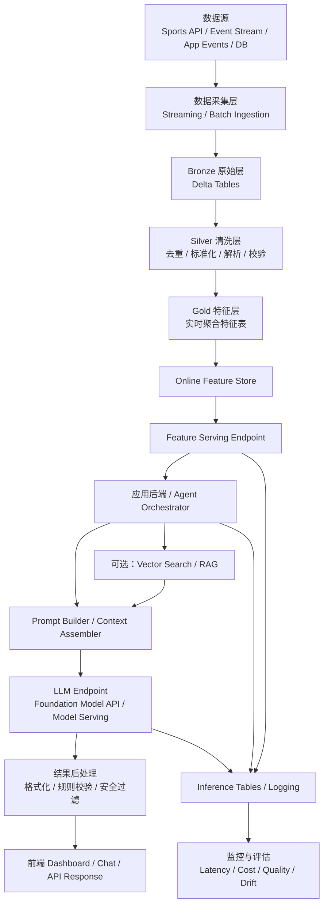

![[Pasted image 20260325215424.png]]
这题最合适选 **C. Feature Serving**。

原因是 Databricks 的 **Feature Serving / Online Feature Store** 就是用来给在线应用和实时模型提供**低延迟、最新的特征数据**，官方文档明确写了它支持 **real-time serving**、**automatic feature lookup**，以及把 Databricks 里的数据提供给外部模型或应用。题目里说的“把最新比分和比赛事件喂给 LLM 分析”，本质上就是要把**新鲜数据实时送到模型侧**，这更符合 Feature Serving 的定位。 ([Databricks Documentation](https://docs.databricks.com/aws/en/machine-learning/feature-store/feature-function-serving?utm_source=chatgpt.com "Feature Serving endpoints | Databricks on AWS"))

其他选项为什么不对：

- **DatabricksIQ**：偏自然语言问数仓/BI 助手，不是实时数据喂给 LLM 的数据服务层。
    
- **Foundation Model APIs**：这是调用大模型本身的接口，负责“用模型”，不是负责把**实时业务数据**持续供给模型。
    
- **AutoML**：是自动建模训练工具，不是实时数据供给工具。 ([Microsoft Learn](https://learn.microsoft.com/en-us/azure/databricks/machine-learning/feature-store/?utm_source=chatgpt.com "Databricks Feature Store"))
    

所以这题答案是：**C. Feature Serving**。

你要的话，我也可以顺手把这题和 **Foundation Model APIs** 为什么容易混淆，给你拆成考试版记忆法。
把数据喂给 **Feature Serving**，目的不是“存一下数据”，而是把**最新、低延迟、可在线调用的特征/上下文数据**提供给你的应用或模型。Databricks 官方对它的定位就是：把 Databricks 平台里的数据提供给外部应用或模型，并以高可用、低延迟的方式在线服务；而 Online Feature Store 则负责高性能、可扩展地保存这些在线特征，并保持和离线特征表的一致性。([Databricks Documentation](https://docs.databricks.com/aws/en/machine-learning/feature-store/feature-function-serving?utm_source=chatgpt.com "Feature Serving endpoints | Databricks on AWS"))

你可以把它理解成：

- **Lakehouse / Delta 表**：存全量、历史、分析型数据
    
- **Online Feature Store + Feature Serving**：把“当前这一刻要用的数据”快速拿出来
    
- **LLM / 应用**：真正消费这些数据，做生成、判断、推荐或实时决策
    

所以，**喂给 Feature Serving 之后，目的是让下游系统在毫秒到低延迟范围内取到最新业务数据**，而不是每次都去扫大表、跑重查询。([Databricks Documentation](https://docs.databricks.com/aws/en/machine-learning/feature-store/feature-function-serving?utm_source=chatgpt.com "Feature Serving endpoints | Databricks on AWS"))

---

## 一、先说清楚：什么数据适合喂给 Feature Serving

不是所有数据都应该喂进去。

最适合的是这三类：

1. **实时变化、在线决策需要的数据**
    
    - 比分
        
    - 当前比赛阶段
        
    - 最新事件
        
    - 当前用户画像
        
    - 当前库存、价格、风控状态
        
2. **已经整理好的、可按 key 查询的数据**
    
    - `game_id`
        
    - `user_id`
        
    - `team_id`
        
3. **需要低延迟返回的数据**
    
    - 聊天助手回答前要补充上下文
        
    - 实时推荐
        
    - 风险判断
        
    - 比赛解说摘要
        

如果是长文档全文检索，那更偏 **Vector Search / RAG 检索**。  
如果是请求和响应监控，那更偏 **Inference Tables / AI Gateway inference tables**。  
如果是“把结构化实时数据按主键快速查出来”，就是 **Feature Serving** 的强项。([Databricks Documentation](https://docs.databricks.com/aws/en/machine-learning/feature-store/feature-function-serving?utm_source=chatgpt.com "Feature Serving endpoints | Databricks on AWS"))

---

## 二、你这个场景的完整方案

我用你刚才那道题的场景来设计：

### 场景

做一个 **LLM-powered sports analytics dashboard**  
要求：

- 实时比分更新
    
- 最新比赛事件
    
- 自动生成 live summary
    
- 可问答：“现在谁领先？”“刚才发生了什么？”“第三节趋势如何？”
    

---

# 方案总览

## 整体架构

**数据源**  
→ **流式采集**  
→ **Bronze / Silver / Gold**  
→ **Offline Feature Table**  
→ **Online Feature Store**  
→ **Feature Serving Endpoint**  
→ **LLM / Agent / Dashboard**  
→ **Serving logs / Inference tables / monitoring**

---

## 三、分阶段设计

### 1）数据接入层

数据来源可以是：

- 第三方体育 API
    
- 比赛事件流
    
- 手工运营录入
    
- 历史 stats 数据库
    

典型原始事件：

- `score_update`
    
- `foul`
    
- `goal`
    
- `timeout`
    
- `quarter_end`
    
- `player_substitution`
    

先把这些原始事件写入 **Bronze Delta table**。

示例：  
`bronze.live_match_events`

字段大概有：

- event_id
    
- game_id
    
- event_ts
    
- event_type
    
- team_id
    
- player_id
    
- raw_payload
    

这里的目标不是直接给 LLM 用，而是**先把原始数据可靠落地**。

---

### 2）数据清洗层

把 Bronze 清洗成 **Silver**：

`silver.live_match_events_clean`

处理内容：

- 去重
    
- 时间格式标准化
    
- 字段展开
    
- 空值处理
    
- 事件类型标准化
    
- 修正延迟到达事件
    
- 按 game_id 做顺序校验
    

比如把原始 payload 解析成：

- home_score
    
- away_score
    
- quarter
    
- clock_remaining
    
- possession
    
- last_event_type
    
- last_event_text
    

这一步的目标是：  
把“难用的原始流”变成“结构化事件”。

---

### 3）特征构建层

再从 Silver 生成 **Gold / Feature Table**。

比如建一张离线特征表：

`gold.game_realtime_features`

主键：

- `game_id`
    

特征字段：

- current_home_score
    
- current_away_score
    
- score_diff
    
- quarter
    
- clock_remaining
    
- leader_team
    
- last_scoring_team
    
- last_5min_home_points
    
- last_5min_away_points
    
- foul_count_home
    
- foul_count_away
    
- momentum_score_home
    
- momentum_score_away
    
- last_event_summary
    
- game_status
    

这一步就是把原始事件变成**LLM 和应用真正好用的上下文**。

重点是：  
**不要把所有原始事件都直接喂给 LLM**。  
应该先压缩成高价值、低噪音、结构清晰的实时特征。

---

### 4）发布到 Online Feature Store

Databricks 官方现在推荐用 **Databricks Online Feature Stores** 做在线特征服务，面向实时应用和实时模型，提供低延迟访问，并和离线表保持一致。([Microsoft Learn](https://learn.microsoft.com/en-us/azure/databricks/machine-learning/feature-store/online-feature-store?utm_source=chatgpt.com "Databricks Online Feature Stores"))

所以这一步是：

- 把 `gold.game_realtime_features`
    
- 持续发布到 Online Feature Store
    

这样你就有了一个适合在线查询的存储层。

这一步的作用是：

- 把离线分析表转成在线可查的数据
    
- 支持高并发、低延迟
    
- 避免 LLM 每次直接扫 Delta 大表
    

---

### 5）建立 Feature Serving Endpoint

然后创建 **Feature Serving endpoint**。  
Databricks 官方说明它会把平台里的数据提供给外部应用或模型，并自动扩缩容，适应实时流量。([Databricks Documentation](https://docs.databricks.com/aws/en/machine-learning/feature-store/feature-function-serving?utm_source=chatgpt.com "Feature Serving endpoints | Databricks on AWS"))

这时候你的 endpoint 可能按 `game_id` 查询，返回像这样：

```json
{
  "game_id": "NBA_20260325_LAL_BOS",
  "current_home_score": 102,
  "current_away_score": 99,
  "quarter": 4,
  "clock_remaining": "02:13",
  "leader_team": "LAL",
  "last_event_summary": "James hits a three-pointer from the left wing.",
  "momentum_score_home": 0.82,
  "momentum_score_away": 0.31,
  "game_status": "LIVE"
}
```

---

### 6）LLM 使用这份数据

这里才轮到 LLM。

## 两种常见用法

### 用法 A：应用层先查 Feature Serving，再把结果拼进 prompt

流程：

用户问：  
“现在比赛怎么样了？”

应用先调用 Feature Serving endpoint：

- 输入：`game_id`
    

拿到实时特征后，构造 prompt：

```text
You are a live sports analyst.
Use only the structured live data below.

Game data:
- Home score: 102
- Away score: 99
- Quarter: 4
- Time remaining: 02:13
- Leader: LAL
- Last event: James hits a three-pointer from the left wing.
- Momentum home: 0.82
- Momentum away: 0.31

Generate a concise live summary in English.
```

然后把这个 prompt 发给 Foundation Model API 或你自己的 serving endpoint。

这个方式最简单，也最稳。

---

### 用法 B：把结构化查询做成 Agent tool

Databricks 官方在 Agent Framework 里推荐：对于已知参数的结构化数据检索，可以用 Unity Catalog functions 或其他 agent tools 来做 structured retrieval。([Databricks Documentation](https://docs.databricks.com/aws/en/generative-ai/agent-framework/create-custom-tool?utm_source=chatgpt.com "Create AI agent tools using Unity Catalog functions"))

你可以让 agent 在需要时：

- 根据 `game_id`
    
- 调一个工具
    
- 工具内部去查 Feature Serving 或对应 UC function
    
- 再把结果返回给 LLM
    

这个更适合：

- 多轮对话
    
- 多数据源混合
    
- “先查比分，再查球员犯规，再给总结”
    

---

## 四、为什么不直接把原始流喂给 LLM

因为那样通常有几个问题：

### 1. 太贵

每次都塞大量事件文本，token 成本高。

### 2. 太乱

LLM 不擅长自己从杂乱实时日志里稳定提炼关键指标。

### 3. 延迟高

原始流很大，prompt 拼接和处理都会慢。

### 4. 不稳定

不同时间窗口、不同事件顺序，容易导致回答漂移。

更合理的是：

**原始流 → 实时特征 → Feature Serving → LLM**

也就是让数据工程先做“压缩和结构化”，LLM 再做“表达和推理”。

---

## 五、一套完整落地流程图

你可以按这个顺序做：

### 数据喂入

体育 API / 事件流  
→ Streaming ingestion  
→ Bronze Delta

### 数据处理

Bronze  
→ Silver 清洗去重  
→ Gold 实时特征表

### 在线供给

Gold 特征表  
→ Online Feature Store  
→ Feature Serving endpoint

### 应用消费

Dashboard backend / agent / app  
→ 调用 Feature Serving  
→ 得到最新结构化特征

### LLM 生成

应用把特征拼进 prompt  
→ 调用 Foundation Model API / external model / serving endpoint  
→ 生成 live summary / explanation / Q&A

### 监控

对模型 endpoint 开启 inference logging / AI Gateway inference tables  
→ 监控 request / response / latency / quality。([Databricks Documentation](https://docs.databricks.com/aws/en/ai-gateway/inference-tables?utm_source=chatgpt.com "Monitor served models using AI Gateway-enabled ..."))

---

## 六、给你一个更实用的企业级设计

如果是正式生产，我会建议拆成 4 个服务。

### 服务 1：实时特征管道

负责：

- 拉比赛事件
    
- 更新 Delta 表
    
- 聚合实时特征
    
- 写入 online feature store
    

### 服务 2：Feature API 层

就是 Databricks Feature Serving endpoint  
负责：

- 按 key 返回最新特征
    
- 给 dashboard/backend/agent 调用
    

### 服务 3：LLM 编排层

负责：

- 判断用户意图
    
- 查 Feature Serving
    
- 查 Vector Search
    
- 拼 prompt
    
- 调 foundation model
    
- 做输出格式控制
    

### 服务 4：监控评估层

负责：

- 请求响应日志
    
- 成本
    
- 延迟
    
- hallucination 审查
    
- prompt / answer 质量评估
    

---

## 七、你真正应该怎么分工

最清晰的职责划分是：

### Feature Serving 负责什么

- 提供**最新、结构化、低延迟**的数据
    
- 按 key 查询
    
- 支撑在线应用
    

### LLM 负责什么

- 总结
    
- 解释
    
- 推断
    
- 对话
    
- 生成自然语言
    

### 规则/应用层负责什么

- 权限控制
    
- prompt 约束
    
- 输出格式
    
- 缓存
    
- fallback 逻辑
    

---

## 八、一个很具体的例子

用户问：

**“用一句话总结一下这场比赛现在的走势。”**

后端流程：

1. 识别 `game_id`
    
2. 调 Feature Serving：
    
    - 取当前比分
        
    - 取最近 5 分钟得分趋势
        
    - 取最后事件
        
    - 取 momentum
        
3. 把这些结构化值塞进 prompt
    
4. 调 LLM
    
5. 返回：
    
    - “湖人末节保持微弱领先，刚刚的三分进一步扩大了主场气势，但比赛仍然胶着。”
        

这里：

- **Feature Serving 提供事实**
    
- **LLM 负责语言化表达**
    

---

## 九、最推荐你的技术路线

如果你现在是 Azure Databricks 上做这套，我建议是：

**Delta Live / Structured Streaming**  
→ **Silver / Gold**  
→ **Online Feature Store**  
→ **Feature Serving endpoint**  
→ **Application backend**  
→ **Foundation Model API 或 Agent endpoint**  
→ **AI Gateway inference tables 做监控**

这条路线最符合 Databricks 现在的产品定位：  
Feature Serving 用来给在线应用和模型提供低延迟数据；Agent tools / structured retrieval 用于给 LLM 接结构化查询能力；AI Gateway inference tables 用于监控 serving 流量和结果。([Databricks Documentation](https://docs.databricks.com/aws/en/machine-learning/feature-store/feature-function-serving?utm_source=chatgpt.com "Feature Serving endpoints | Databricks on AWS"))

---

## 十、给你一句最核心的话

**把数据喂给 Feature Serving，不是为了让它“理解数据”，而是为了让你的 LLM 或应用能“快速拿到最新事实”。**

LLM 不该直接面对脏乱的实时原始流。  
更好的方式是：

**先把数据工程化、特征化、在线化，再让 LLM 消费它。**

我可以下一步直接给你画一张“Azure Databricks 上的完整架构图”，或者给你一套按比赛场景写的表设计和接口设计。

可以。下面给你一个 **“实时数据 → Feature Serving → LLM → Dashboard”** 的端到端流程图，按你前面那个 sports / 实时分析场景来设计，但这个架构也可以迁移到客服、风控、推荐、IoT 等场景。

## 端到端流程图



---

## 你可以这样理解每一层

### 1. 数据源

这里是最上游的数据输入，比如：

- 实时比赛事件
    
- 比分更新
    
- 用户行为
    
- 交易记录
    
- 设备 telemetry
    

---

### 2. 数据采集层

负责把数据接进 Databricks：

- 实时流用 streaming
    
- 定时同步用 batch
    

目标是先把数据稳定接住，不丢、不乱。

---

### 3. Bronze 原始层

这是原始落地层，通常保留：

- 原始字段
    
- 原始 payload
    
- 到达时间
    
- 来源信息
    

作用是保真、可追溯。

---

### 4. Silver 清洗层

这里开始做数据处理：

- 去重
    
- 格式统一
    
- 字段展开
    
- 数据类型修正
    
- 业务规则校验
    
- 异常值处理
    

这一层把“能存”变成“能用”。

---

### 5. Gold 特征层

这一层最关键。  
这里把事件流加工成 **在线可消费的特征**，例如：

- 当前比分
    
- 最近 5 分钟得分
    
- 当前领先方
    
- 最后一次事件摘要
    
- 风险等级
    
- 用户最近活跃度
    
- 当前库存状态
    

也就是说，**原始事件变成结构化上下文**。

---

### 6. Online Feature Store

把 Gold 的特征发布成在线特征存储。

目的：

- 支持低延迟查询
    
- 给在线应用和模型使用
    
- 不需要每次都去扫大表
    

---

### 7. Feature Serving Endpoint

这是对外的在线接口。

比如应用传一个 `game_id` 或 `user_id`，它立刻返回这条记录当前最新特征：

```json
{
  "game_id": "match_001",
  "home_score": 98,
  "away_score": 95,
  "quarter": 4,
  "clock_remaining": "01:52",
  "leader_team": "Home",
  "last_event_summary": "Three-point shot made"
}
```

**这一步就是“把数据喂给 LLM 前，先查事实”。**

---

### 8. 应用后端 / Agent Orchestrator

这一层负责业务编排：

- 收到用户请求
    
- 判断需要查哪些数据
    
- 调 Feature Serving
    
- 可选再调 Vector Search
    
- 组织上下文
    
- 调 LLM
    

这一层相当于“大脑调度器”。

---

### 9. Prompt Builder / Context Assembler

把结构化数据拼成模型能理解的上下文。

例如：

```text
Game status:
- Home score: 98
- Away score: 95
- Quarter: 4
- Time remaining: 01:52
- Last event: Three-point shot made
- Leader: Home

Task:
Generate a concise live game summary.
```

---

### 10. LLM Endpoint

这里才是真正调用大模型：

- Foundation Model API
    
- 自己部署的 Model Serving endpoint
    
- 外部 LLM
    

LLM 的职责不是查实时数据，  
而是根据你喂进去的最新事实：

- 总结
    
- 解释
    
- 回答问题
    
- 生成自然语言
    

---

### 11. 结果后处理

LLM 的原始输出通常还要加工一下，比如：

- JSON 格式化
    
- 字数限制
    
- 业务规则校验
    
- 敏感内容过滤
    
- 置信度判断
    
- fallback 逻辑
    

---

### 12. 前端 Dashboard / Chat / API

最终结果给到：

- BI dashboard
    
- 聊天机器人
    
- 移动端
    
- 外部 API
    

---

### 13. 可选：Vector Search / RAG

如果除了实时结构化数据，还要补充：

- 历史报道
    
- 球队资料
    
- 规则说明
    
- FAQ
    
- 文档知识库
    

那就加一条 RAG 线路，把非结构化知识也喂给 LLM。

所以常见组合是：

- **Feature Serving**：提供最新结构化事实
    
- **Vector Search**：提供相关文档片段
    
- **LLM**：统一生成答案
    

---

### 14. Logging / Inference Tables / Monitoring

整条链路要能监控：

- 调了哪些特征
    
- LLM 输入输出是什么
    
- 延迟多少
    
- 成本多少
    
- 是否答非所问
    
- 数据是否漂移
    

这部分是生产系统必须有的。

---

## 再给你一个更贴近“请求流”的流程图

```mermaid
sequenceDiagram
    participant U as 用户
    participant FE as Dashboard / Chat UI
    participant BE as 应用后端
    participant FS as Feature Serving
    participant VS as Vector Search
    participant LLM as LLM Endpoint
    participant MON as Logging / Monitoring

    U->>FE: 提问 / 打开页面
    FE->>BE: 请求实时分析
    BE->>FS: 按 game_id / user_id 查询最新特征
    FS-->>BE: 返回结构化实时数据
    BE->>VS: 检索相关文档（可选）
    VS-->>BE: 返回相关文本片段
    BE->>LLM: 发送 prompt + 实时特征 + 检索上下文
    LLM-->>BE: 返回总结 / 回答 / 分析
    BE->>MON: 记录请求、延迟、结果
    LLM->>MON: 记录模型输入输出
    FE<<--BE: 返回最终结果给用户
```

---

## 一句话总结这条链路

**数据先进 Delta，处理成特征，发布到 Feature Serving，由应用取回最新事实，再交给 LLM 做表达和推理，最后把结果展示给用户，并全程监控。**

---

## 如果你要落地，我建议拆成这 6 个模块

1. **Ingestion**
    
2. **Transformation**
    
3. **Feature Layer**
    
4. **Serving Layer**
    
5. **LLM Orchestration**
    
6. **Monitoring**
    

---

## 最后给你一个最实用的简化版

```text
实时数据源
→ Databricks Streaming
→ Bronze / Silver / Gold
→ Online Feature Store
→ Feature Serving Endpoint
→ Backend / Agent
→ LLM
→ Dashboard / Chat
→ Logging & Monitoring
```

如果你愿意，我下一步可以直接给你画一个 **Azure Databricks 版本的架构图**，把里面具体标成：  
**Delta Live Tables / Unity Catalog / Online Feature Store / Feature Serving / Foundation Model API / Inference Tables**。