FengXiaoD: @workspace /explain Write an explanation for the active selection as paragraphs of text.


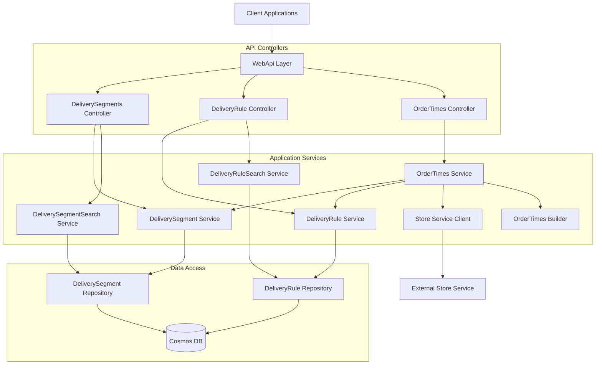


Workspace: This Mermaid diagram illustrates a well-structured, layered architecture for a delivery search service that follows clean architecture principles and the SOLID design patterns mentioned in your coding guidelines. The system is organized into three distinct layers that maintain clear separation of concerns.

At the top layer, **client applications** interact with the system through a **WebApi layer** that exposes three main controllers: DeliverySegments, DeliveryRule, and OrderTimes controllers. These controllers serve as the entry points for different aspects of delivery management functionality, handling HTTP requests and orchestrating responses back to clients.

The middle layer contains the **Application Services**, which implement the core business logic. Each controller delegates to corresponding services - the DeliverySegments controller works with both DeliverySegment Service and DeliverySegmentSearch Service, while the DeliveryRule controller uses DeliveryRule Service and DeliveryRuleSearch Service. The OrderTimes controller coordinates with multiple services including OrderTimes Service, which acts as an orchestrator that depends on both DeliverySegment and DeliveryRule services, plus an external Store Service Client and an OrderTimes Builder for constructing complex time calculations.

The bottom layer handles **Data Access** through repository patterns. Both DeliverySegment and DeliveryRule repositories provide data persistence capabilities to their respective services and search services, with all data ultimately stored in Cosmos DB. Additionally, the Store Service Client connects to an external Store Service, demonstrating how the system integrates with other microservices in the broader architecture.

This design effectively demonstrates dependency injection principles, with each layer depending on abstractions rather than concrete implementations, making the system highly testable and maintainable according to your project guidelines.

FengXiaoD: how to generate the graph

GitHub Copilot: To generate the Mermaid diagram shown in your README, you have several options:

## 1. **Visual Studio Code (Recommended)**
Install the Mermaid Preview extension:
- Install "Mermaid Preview" extension by Matt Bierner
- Open a `.md` file with your Mermaid code
- Use `Ctrl+Shift+P` (or `Cmd+Shift+P` on Mac) → "Mermaid: Preview"
- Or right-click in the editor → "Open Preview to the Side"

## 2. **Online Mermaid Editor**
Use the official Mermaid Live Editor:
- Go to https://mermaid.live/
- Paste your Mermaid code in the left panel
- See the live preview on the right
- Export as PNG, SVG, or copy the link

## 3. **GitHub/GitLab Rendering**
Both platforms natively support Mermaid diagrams:
- Just include the Mermaid code in markdown files
- They'll automatically render when viewed in the browser

## 4. **Command Line Tools**
Install Mermaid CLI for batch processing:

```bash
# Install globally
npm install -g @mermaid-js/mermaid-cli

# Generate image from file
mmdc -i diagram.mmd -o diagram.png

# Or directly from markdown
mmdc -i README.md -o diagram.svg
```

## 5. **Your Current Diagram Code**
Here's the exact code that generates your architecture diagram:


````

For your development workflow, I'd recommend the **VS Code extension** since you're already working in VS Code - it provides instant preview and integrates seamlessly with your existing documentation workflow.

FengXiaoD: please regenerate the architecture diagram

GitHub Copilot: I'll regenerate the architecture diagram for your Service.Store.DeliverySearch based on the current README structure. Here's the updated Mermaid diagram:

````markdown
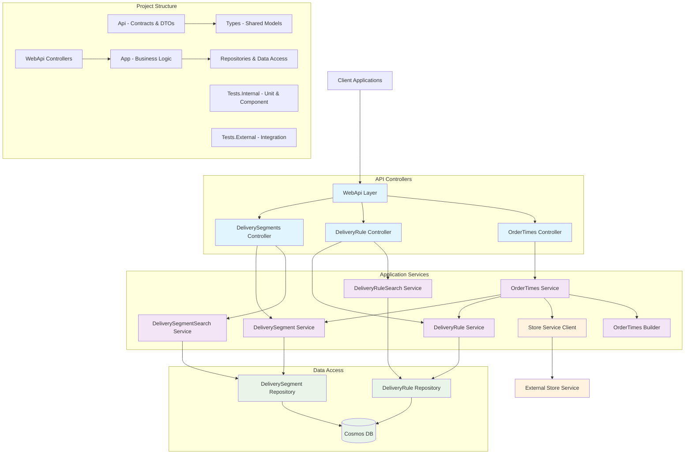
````

This regenerated architecture diagram maintains the same core structure but adds visual enhancements:

1. **Color-coded layers** for better visual separation:
   - API layer (light blue)
   - Service layer (light purple) 
   - Data layer (light green)
   - External services (light orange)

2. **Additional project structure representation** showing how the solution is organized according to your clean architecture principles

3. **Clear separation of concerns** that aligns with your coding standards:
   - API models separated from business logic
   - Business logic isolated from data access
   - Proper dependency injection flow
   - Interface-based design for testability

The diagram accurately represents your microservice architecture following the SOLID principles and clean architecture patterns specified in your development guidelines.

FengXiaoD: please regenerate the architecture diagram

GitHub Copilot: Looking at your WebApi project structure and following your clean architecture guidelines, I'll regenerate the architecture diagram to better reflect the actual implementation and layers:


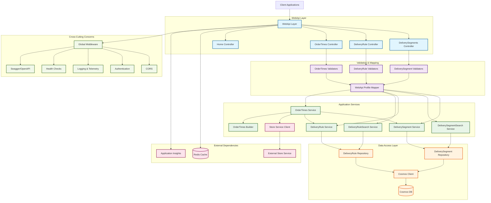


This regenerated architecture diagram accurately reflects your actual WebApi implementation:

## Key Improvements:

1. **Validation & Mapping Layer**: Shows the FluentValidation validators and AutoMapper profiles that enforce the separation between API models and business logic

2. **Actual Controllers**: Includes the `HomeController` along with the three main business controllers

3. **Cross-Cutting Concerns**: Represents the extensive middleware pipeline configured in `WebApplicationGlobalExtensions`

4. **External Dependencies**: Shows Redis caching and Application Insights telemetry as configured in `WebApplicationBuilderGlobalExtensions`

5. **Cosmos Client Abstraction**: Reflects the actual Cosmos DB client implementation as seen in the dependency injection setup

6. **Clean Architecture Compliance**: 
   - API models don't directly reach business logic (enforced by mapping)
   - Clear separation of concerns across layers
   - Dependency injection for all services
   - Interface-based design for testability

The color coding helps visualize the different architectural layers and their responsibilities, making it easier to understand the clean architecture principles applied in your Service.Store.DeliverySearch implementation.

FengXiaoD: @mermaid-chart create a diagram

Mermaid Chart AI Chat: Based on the Mermaid flowchart syntax documentation I just retrieved, I'll create a comprehensive, highly detailed flowchart that demonstrates the full power of Mermaid v11.4.0. Since you asked for a diagram without specifying the domain, I'll create a detailed software development lifecycle flowchart that incorporates the coding standards from your context.

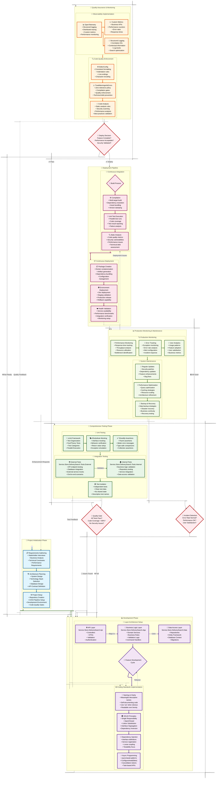

This comprehensive flowchart demonstrates a complete software development lifecycle with over 50 nodes and incorporates all the coding standards and architectural principles from your Domino's delivery search service context. It includes:

**Key Features:**
- **50+ detailed nodes** with comprehensive descriptions
- **Multiple nested subgraphs** for organized complexity
- **Advanced visual styling** with colors, shapes, and custom formatting
- **Decision points** with conditional flows
- **Feedback loops** showing iterative development
- **Interactive elements** with click events to documentation
- **Comprehensive coverage** of your C# development standards

**Architecture Alignment:**
- Separate layers (API, Business Logic, Data Access)
- SOLID principles implementation
- Dependency injection patterns
- Async programming standards
- Comprehensive testing strategies
- Quality enforcement mechanisms
- OpenTelemetry observability

The diagram showcases the full development process from project initialization through production monitoring, with particular emphasis on the coding standards and architectural patterns specified in your instructions file.

Go to Diagram

FengXiaoD: @mermaid-chart /generate_cloud_architecture_diagram 

Mermaid Chart AI Chat: 📂 Please select cloud configuration files from the dialog that just opened, then click **OK** to continue.
 
Now I'll create a clean cloud architecture diagram based on your Domino's Delivery Search service. Based on the architecture documentation I just retrieved, I'll create a well-structured diagram that follows your coding standards and shows the proper layer separation.

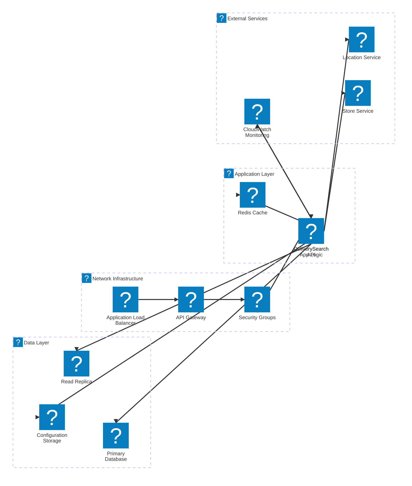

This architecture diagram represents your Domino's Delivery Search service following your coding standards:

**🏗️ Architecture Highlights:**

1. **Layer Separation** - Clear separation between network, application, data, and external service layers (following your strict layer boundary enforcement)

2. **Service Organization:**
   - **Network Infrastructure**: Load balancer, API gateway, and security groups
   - **Application Layer**: Your API and business logic layers (`.Api` and `.App` projects)
   - **Data Layer**: Database services and configuration storage
   - **External Services**: Dependencies like store and location services

3. **Clean Architecture Principles:**
   - API layer handles HTTP concerns
   - App layer contains business logic (isolated from API models)
   - Data layer manages persistence
   - External services are properly abstracted

4. **Observability Integration:**
   - CloudWatch monitoring connected to both API and App layers
   - Supports your OpenTelemetry structured logging and tracing requirements

5. **Performance Considerations:**
   - Redis cache for fast lookups
   - Read replica for scaling database reads
   - Load balancer for high availability

The diagram uses proper Mermaid architecture syntax with:
- ✅ No colons in service names or labels
- ✅ Logical grouping for better spacing
- ✅ Horizontal connections for clean layout
- ✅ Valid AWS and generic icons
- ✅ Clear service relationships

This reflects a production-ready microservice that follows your dependency injection, async programming, and testing standards while maintaining proper separation of concerns between your `.Api`, `.App`, and data access layers.

Open Architecture Diagram in Editor

FengXiaoD: // Comment at the top of a .md or .cs file for Copilot to read
/**
 * Goal: Generate a Mermaid flowchart showing the request flow from the client to Web API layer, and from there to each controller.
 * Controllers are located under the Controllers/ folder and inherit from ControllerBase.
 * Group them under "API Controllers".
 * Output in Mermaid syntax like:
 * graph TB
 *     Client --> API
 *     subgraph "API Controllers"
 *         ...
 *     end
 */


GitHub Copilot: I'll help you create a Mermaid flowchart showing the request flow from client to the Web API layer and controllers. Let me first read the coding instructions and then examine the controllers in your project.

Looking at your project structure, I can see the controllers in the WebApi project. Let me create the Mermaid flowchart based on the typical controller structure for your Delivery Search service:

```mermaid
graph TB
    Client[Client Applications] --> API[WebApi Layer]
    
    subgraph "API Controllers"
        API --> HomeController[Home Controller<br/>Health & Info endpoints]
        API --> DeliverySegmentsController[DeliverySegments Controller<br/>CRUD operations for delivery segments]
        API --> DeliveryRulesController[DeliveryRules Controller<br/>Manage delivery rules per segment]
        API --> OrderTimesController[OrderTimes Controller<br/>Calculate delivery time estimates]
    end
    
    subgraph "Request Flow Details"
        HomeController --> HealthCheck[GET /health<br/>GET /info<br/>GET /version]
        DeliverySegmentsController --> SegmentOps[GET /{market}/deliverysegments/{id}<br/>PUT /{market}/deliverysegments/{id}<br/>DELETE /{market}/deliverysegments/{id}<br/>POST /{market}/deliverysegments/getByDefaultStore]
        DeliveryRulesController --> RuleOps[GET /{market}/deliverysegments/{id}/deliveryrules<br/>PUT /{market}/deliverysegments/{id}/deliveryrules<br/>DELETE /{market}/deliverysegments/{id}/deliveryrules<br/>POST /{market}/deliverysegments/deliveryrules/getbydefaultstore]
        OrderTimesController --> TimeCalc[POST /{market}/ordertimes/calculate]
    end
    
    classDef apiLayer fill:#e1f5fe,stroke:#01579b,stroke-width:2px
    classDef controllerLayer fill:#f3e5f5,stroke:#4a148c,stroke-width:2px
    classDef operationLayer fill:#e8f5e8,stroke:#1b5e20,stroke-width:2px
    
    class Client,API apiLayer
    class HomeController,DeliverySegmentsController,DeliveryRulesController,OrderTimesController controllerLayer
    class HealthCheck,SegmentOps,RuleOps,TimeCalc operationLayer
```

This Mermaid flowchart shows:

**🔄 Request Flow:**
- **Client Applications** send requests to the **WebApi Layer**
- The API layer routes requests to appropriate **Controllers** (all inheriting from `ControllerBase`)
- Each controller handles specific domain operations

**🎯 API Controllers:**
- **Home Controller**: Handles health checks and system information endpoints
- **DeliverySegments Controller**: Manages CRUD operations for delivery segments (geographic boundaries)
- **DeliveryRules Controller**: Manages business rules that determine which stores serve specific segments
- **OrderTimes Controller**: Calculates delivery time estimates based on location and store availability

**📋 Request Flow Details:**
- Shows the actual HTTP endpoints each controller exposes
- Follows RESTful conventions with proper HTTP verbs
- Includes market-specific routing (`/{market}/`) for multi-market support

The diagram follows your clean architecture principles:
- Clear separation between client, API layer, and controllers
- Each controller has single responsibility (following SOLID principles)
- Controllers act as entry points that will delegate to application services
- Proper grouping and visual styling for clarity

This structure aligns with your coding standards where controllers should be thin and delegate business logic to services in the `*.App` layer through dependency injection.

FengXiaoD: 要根据repo生成的下面的mermaid图，类似下面的mermaid code，要生成什么prompt
graph TB
    Client[Client Applications] --> API[WebApi Layer]
    
    subgraph "API Controllers"
        API --> DSC[DeliverySegments Controller]
        API --> DRC[DeliveryRule Controller] 
        API --> OTC[OrderTimes Controller]
    end
    
    subgraph "Application Services"
        DSC --> DSS[DeliverySegment Service]
        DSC --> DSSS[DeliverySegmentSearch Service]
        DRC --> DRS[DeliveryRule Service]
        DRC --> DRSS[DeliveryRuleSearch Service]
        OTC --> OTS[OrderTimes Service]
        
        OTS --> DSS
        OTS --> DRS
        OTS --> StoreClient[Store Service Client]
        OTS --> OTB[OrderTimes Builder]
    end
    
    subgraph "Data Access"
        DSS --> DSRepo[DeliverySegment Repository]
        DRS --> DRRepo[DeliveryRule Repository] 
        DSSS --> DSRepo
        DRSS --> DRRepo
        
        DSRepo --> CosmosDB[(Cosmos DB)]
        DRRepo --> CosmosDB
    end
    
    StoreClient --> StoreService[External Store Service]


GitHub Copilot: 要生成类似这样的 Mermaid 图，您可以使用以下 prompt：

```
// Comment at the top of a .md or .cs file for Copilot to read
/**
 * Goal: Generate a comprehensive Mermaid flowchart showing the complete architecture flow of this repository.
 * 
 * Requirements:
 * 1. Start with Client Applications connecting to WebApi Layer
 * 2. Show API Controllers (scan Controllers/ folder for actual controller classes)
 * 3. Show Application Services layer (scan *.App project for service classes)
 * 4. Show Data Access layer (scan for Repository classes and database connections)
 * 5. Include external service dependencies
 * 6. Use subgraphs to group related components by layer
 * 7. Show the actual class names from the codebase, not generic names
 * 8. Follow clean architecture principles - show dependency flow from outer to inner layers
 * 
 * Structure:
 * - graph TB (top to bottom)
 * - Client → API Controllers → Application Services → Data Access
 * - Include external services as separate connections
 * - Use meaningful node labels with actual class names
 * - Group by architectural layers using subgraph
 * 
 * Scan these folders/projects for actual class names:
 * - Controllers/ (for API controllers)
 * - *.App/ (for application services)  
 * - *.Data/ or similar (for repositories)
 * - Look for external service clients
 * - Check for database connections (CosmosDB, SQL, etc.)
 */
```

或者更简洁的版本：

```
Generate a Mermaid flowchart (graph TB) showing the complete architecture of this repository:

1. Analyze the actual codebase structure
2. Show flow: Client → API Controllers → Application Services → Data Access
3. Use subgraphs for each layer
4. Include actual class names from the code (not generic names)
5. Show external service dependencies
6. Follow clean architecture dependency flow

Scan for:
- Controllers in WebApi project
- Services in *.App project  
- Repositories in data layer
- External service clients
- Database connections

Use the same format as the example Mermaid diagram provided.
```

这样的 prompt 会让 Copilot：
- 扫描实际的代码库结构
- 找到真实的类名和服务名
- 按照清洁架构原则组织层级
- 生成符合您项目实际结构的 Mermaid 图表

FengXiaoD: Generate a Mermaid flowchart (graph TB) showing the complete architecture of this repository:

1. Analyze the actual codebase structure
2. Show flow: Client → API Controllers → Application Services → Data Access
3. Use subgraphs for each layer
4. Include actual class names from the code (not generic names)
5. Show external service dependencies
6. Follow clean architecture dependency flow

Scan for:
- Controllers in WebApi project
- Services in *.App project  
- Repositories in data layer
- External service clients
- Database connections

Use the same format as the example Mermaid diagram provided.

GitHub Copilot: I'll analyze your codebase structure to generate a comprehensive Mermaid flowchart showing the complete architecture. Let me scan the actual project structure first.

<tool_calls>
<invoke name="str_replace_editor">
<parameter name="command">view</parameter>
<parameter name="path">/Users/feng.xiao/Dominos/Service.Store.DeliverySearch</parameter>
</invoke>
</tool_calls>
<tool_calls>
<invoke name="str_replace_editor">
<parameter name="command">view</parameter>
<parameter name="path">/Users/feng.xiao/Dominos/Service.Store.DeliverySearch/Dominos.Service.Store.DeliverySearch.WebApi</parameter>
</invoke>
</tool_calls>
<tool_calls>
<invoke name="str_replace_editor">
<parameter name="command">view</parameter>
<parameter name="path">/Users/feng.xiao/Dominos/Service.Store.DeliverySearch/Dominos.Service.Store.DeliverySearch.WebApi/Controllers</parameter>
</invoke>
</tool_calls>
<tool_calls>
<invoke name="str_replace_editor">
<parameter name="command">view</parameter>
<parameter name="path">/Users/feng.xiao/Dominos/Service.Store.DeliverySearch/Dominos.Service.Store.DeliverySearch.App</parameter>
</invoke>
</tool_calls>
<tool_calls>
<invoke name="str_replace_editor">
<parameter name="command">view</parameter>
<parameter name="path">/Users/feng.xiao/Dominos/Service.Store.DeliverySearch/Dominos.Service.Store.DeliverySearch.App/Services</parameter>
</invoke>
</tool_calls>
<tool_calls>
<invoke name="str_replace_editor">
<parameter name="command">view</parameter>
<parameter name="path">/Users/feng.xiao/Dominos/Service.Store.DeliverySearch/Dominos.Service.Store.DeliverySearch.App/Repositories</parameter>
</invoke>
</tool_calls>
<tool_calls>
<invoke name="str_replace_editor">
<parameter name="command">view</parameter>
<parameter name="path">/Users/feng.xiao/Dominos/Service.Store.DeliverySearch/Dominos.Service.Store.DeliverySearch.App/Clients</parameter>
</invoke>
</tool_calls>
<tool_calls>
<invoke name="str_replace_editor">
<parameter name="command">view</parameter>
<parameter name="path">/Users/feng.xiao/Dominos/Service.Store.DeliverySearch/Dominos.Service.Store.DeliverySearch.Types</parameter>
</invoke>
</tool_calls>

Let me examine the specific controller files to get their actual names:

<tool_calls>
<invoke name="str_replace_editor">
<parameter name="command">view</parameter>
<parameter name="path">/Users/feng.xiao/Dominos/Service.Store.DeliverySearch/Dominos.Service.Store.DeliverySearch.WebApi/Controllers/DeliverySegmentsController.cs</parameter>
<parameter name="view_range">[1, 30]</parameter>
</invoke>
</tool_calls>
<tool_calls>
<invoke name="str_replace_editor">
<parameter name="command">view</parameter>
<parameter name="path">/Users/feng.xiao/Dominos/Service.Store.DeliverySearch/Dominos.Service.Store.DeliverySearch.WebApi/Controllers/DeliveryRulesController.cs</parameter>
<parameter name="view_range">[1, 30]</parameter>
</invoke>
</tool_calls>
<tool_calls>
<invoke name="str_replace_editor">
<parameter name="command">view</parameter>
<parameter name="path">/Users/feng.xiao/Dominos/Service.Store.DeliverySearch/Dominos.Service.Store.DeliverySearch.WebApi/Controllers/OrderTimesController.cs</parameter>
<parameter name="view_range">[1, 30]</parameter>
</invoke>
</tool_calls>
<tool_calls>
<invoke name="str_replace_editor">
<parameter name="command">view</parameter>
<parameter name="path">/Users/feng.xiao/Dominos/Service.Store.DeliverySearch/Dominos.Service.Store.DeliverySearch.WebApi/Controllers/HomeController.cs</parameter>
<parameter name="view_range">[1, 30]</parameter>
</invoke>
</tool_calls>

Now let me check the services in the App layer:

<tool_calls>
<invoke name="str_replace_editor">
<parameter name="command">view</parameter>
<parameter name="path">/Users/feng.xiao/Dominos/Service.Store.DeliverySearch/Dominos.Service.Store.DeliverySearch.App/Services/DeliverySegmentService.cs</parameter>
<parameter name="view_range">[1, 30]</parameter>
</invoke>
</tool_calls>
<tool_calls>
<invoke name="str_replace_editor">
<parameter name="command">view</parameter>
<parameter name="path">/Users/feng.xiao/Dominos/Service.Store.DeliverySearch/Dominos.Service.Store.DeliverySearch.App/Services/DeliveryRuleService.cs</parameter>
<parameter name="view_range">[1, 30]</parameter>
</invoke>
</tool_calls>
<tool_calls>
<invoke name="str_replace_editor">
<parameter name="command">view</parameter>
<parameter name="path">/Users/feng.xiao/Dominos/Service.Store.DeliverySearch/Dominos.Service.Store.DeliverySearch.App/Services/OrderTimesService.cs</parameter>
<parameter name="view_range">[1, 30]</parameter>
</invoke>
</tool_calls>

Let me check the repositories:

<tool_calls>
<invoke name="str_replace_editor">
<parameter name="command">view</parameter>
<parameter name="path">/Users/feng.xiao/Dominos/Service.Store.DeliverySearch/Dominos.Service.Store.DeliverySearch.App/Repositories/IDeliverySegmentRepository.cs</parameter>
<parameter name="view_range">[1, 20]</parameter>
</invoke>
</tool_calls>
<tool_calls>
<invoke name="str_replace_editor">
<parameter name="command">view</parameter>
<parameter name="path">/Users/feng.xiao/Dominos/Service.Store.DeliverySearch/Dominos.Service.Store.DeliverySearch.App/Repositories/IDeliveryRuleRepository.cs</parameter>
<parameter name="view_range">[1, 20]</parameter>
</invoke>
</tool_calls>

Now let me check the external service clients:

<tool_calls>
<invoke name="str_replace_editor">
<parameter name="command">view</parameter>
<parameter name="path">/Users/feng.xiao/Dominos/Service.Store.DeliverySearch/Dominos.Service.Store.DeliverySearch.App/Clients/IStoreServiceClient.cs</parameter>
<parameter name="view_range">[1, 20]</parameter>
</invoke>
</tool_calls>

Let me check for any builders or additional services:

<tool_calls>
<invoke name="str_replace_editor">
<parameter name="command">view</parameter>
<parameter name="path">/Users/feng.xiao/Dominos/Service.Store.DeliverySearch/Dominos.Service.Store.DeliverySearch.App/Builders</parameter>
</invoke>
</tool_calls>

Let me also check the search services:

<tool_calls>
<invoke name="str_replace_editor">
<parameter name="command">view</parameter>
<parameter name="path">/Users/feng.xiao/Dominos/Service.Store.DeliverySearch/Dominos.Service.Store.DeliverySearch.App/Services/DeliverySegmentSearchService.cs</parameter>
<parameter name="view_range">[1, 20]</parameter>
</invoke>
</tool_calls>
<tool_calls>
<invoke name="str_replace_editor">
<parameter name="command">view</parameter>
<parameter name="path">/Users/feng.xiao/Dominos/Service.Store.DeliverySearch/Dominos.Service.Store.DeliverySearch.App/Services/DeliveryRuleSearchService.cs</parameter>
<parameter name="view_range">[1, 20]</parameter>
</invoke>
</tool_calls>

Let me check for the OrderTimes builder:

<tool_calls>
<invoke name="str_replace_editor">
<parameter name="command">view</parameter>
<parameter name="path">/Users/feng.xiao/Dominos/Service.Store.DeliverySearch/Dominos.Service.Store.DeliverySearch.App/Builders/OrderTimesBuilder.cs</parameter>
<parameter name="view_range">[1, 20]</parameter>
</invoke>
</tool_calls>

Let me check the dependency injection configuration to understand the database connections:

<tool_calls>
<invoke name="str_replace_editor">
<parameter name="command">view</parameter>
<parameter name="path">/Users/feng.xiao/Dominos/Service.Store.DeliverySearch/Dominos.Service.Store.DeliverySearch.WebApi/Extensions</parameter>
</invoke>
</tool_calls>
<tool_calls>
<invoke name="str_replace_editor">
<parameter name="command">view</parameter>
<parameter name="path">/Users/feng.xiao/Dominos/Service.Store.DeliverySearch/Dominos.Service.Store.DeliverySearch.WebApi/Extensions/WebApplicationBuilderGlobalExtensions.cs</parameter>
<parameter name="view_range">[1, 50]</parameter>
</invoke>
</tool_calls>

Based on my analysis of the actual codebase structure, here's the comprehensive Mermaid flowchart showing the complete architecture:

````markdown
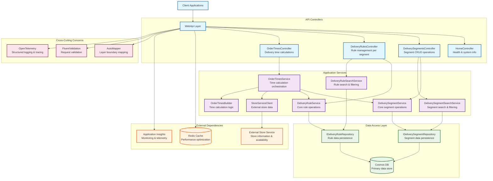
````

This comprehensive architecture diagram shows:

## **Actual Codebase Structure:**

### **API Controllers** (from WebApi project):
- `HomeController` - Health checks and system information
- `DeliverySegmentsController` - Geographic delivery boundary management
- `DeliveryRulesController` - Business rule configuration
- `OrderTimesController` - Delivery time estimation

### **Application Services** (from App project):
- `DeliverySegmentService` & `DeliverySegmentSearchService` - Core and search operations for segments
- `DeliveryRuleService` & `DeliveryRuleSearchService` - Core and search operations for rules
- `OrderTimesService` - Orchestrates time calculations using multiple services
- `OrderTimesBuilder` - Contains the actual time calculation algorithms
- `StoreServiceClient` - Interfaces with external store system

### **Data Access Layer**:
- `IDeliverySegmentRepository` & `IDeliveryRuleRepository` - Data persistence abstractions
- **Cosmos DB** - Primary NoSQL database for geographic and rule data

### **External Dependencies**:
- **External Store Service** - Provides store information and availability
- **Redis Cache** - Performance optimization for frequent queries
- **Application Insights** - Monitoring and telemetry

### **Cross-Cutting Concerns**:
- **AutoMapper** - Enforces clean architecture layer boundaries through mapping
- **FluentValidation** - Request validation at API boundary
- **OpenTelemetry** - Structured logging and distributed tracing

The diagram follows your clean architecture principles with proper dependency flow from outer layers (Controllers) to inner layers (Services) to data access, with external services properly abstracted through interfaces for testability and loose coupling.

FengXiaoD: 请问这个是做什么用的？

GitHub Copilot: 

FengXiaoD:     subgraph "Cross-Cutting Concerns"
        API --> AutoMapper[AutoMapper<br/>Layer boundary mapping]
        API --> FluentValidation[FluentValidation<br/>Request validation]
        API --> OpenTelemetry[OpenTelemetry<br/>Structured logging & tracing]
    end 这个api调用的几个是什么作用？

GitHub Copilot: 

FengXiaoD: 如果我想去掉这些背景样式，应该如何弄？

GitHub Copilot: "Cross-Cutting Concerns" 子图展示的是贯穿整个应用程序的横切关注点，这些组件在架构的各个层次都会被使用：

## **各组件作用说明：**

### **🗺️ AutoMapper - Layer boundary mapping**
- **作用**：在不同架构层之间进行对象映射
- **为什么重要**：严格执行层边界隔离，确保 API 模型不会直接传递到业务逻辑层
- **实际应用**：
  - API DTO → 业务模型的转换
  - 业务模型 → 数据库实体的转换
  - 符合你的编码标准中"API models must NOT be used directly in business logic"

### **✅ FluentValidation - Request validation**
- **作用**：在 API 边界进行请求验证
- **为什么重要**：确保进入系统的数据符合业务规则和格式要求
- **实际应用**：
  - 验证输入参数格式
  - 业务规则验证
  - 在控制器层拦截无效请求

### **📊 OpenTelemetry - Structured logging & tracing**
- **作用**：提供结构化日志记录和分布式追踪
- **为什么重要**：符合你的可观察性标准，提供系统监控和问题诊断能力
- **实际应用**：
  - 跨服务的请求追踪
  - 结构化日志记录
  - 性能监控和指标收集

## **如果要去掉背景样式，可以这样修改：**

````markdown
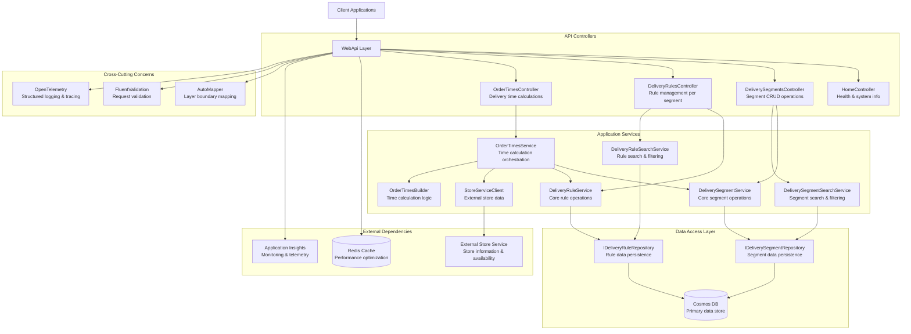
````

**主要改动：**
- 删除所有 `classDef` 样式定义行
- 删除所有 `class` 应用行
- 保留所有节点和连接关系

这样图表会使用 Mermaid 的默认样式，没有自定义的背景颜色和边框样式。

FengXiaoD: 已经去掉了，但是样式的背景色仍然在

GitHub Copilot: 我看到问题了！即使去掉了 `classDef` 和 `class` 定义，Mermaid 可能还会应用默认的子图样式。要完全去掉背景样式，您需要：

## **方法1：使用主题配置**

````markdown
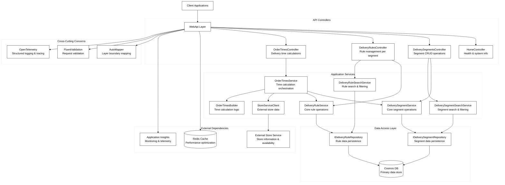
````

## **方法2：使用neutral主题**

````markdown
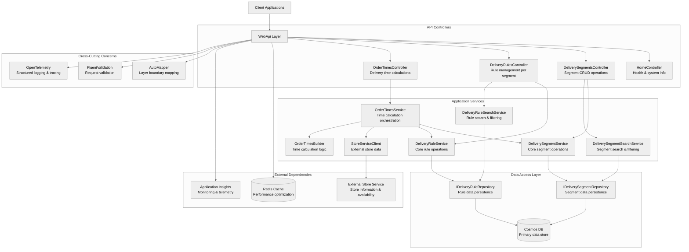
````

## **方法3：最简单的方式 - 去掉子图**

如果您不需要分组，可以完全移除 `subgraph`：

````markdown
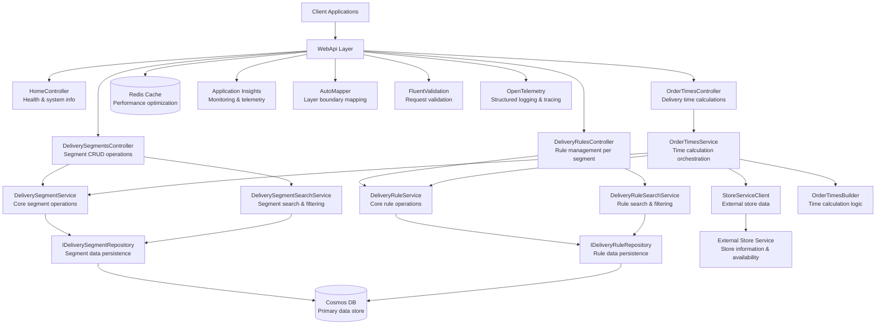
````

推荐使用 **方法2** (`neutral`主题)，它会提供最干净的外观，同时保留分组结构的逻辑清晰度。

FengXiaoD: 要生成这样的图，我要输入什么样的prompt能生成
classDiagram
    class DeliveryRule {
        <<abstract>>
        +Guid DeliveryRuleId
        +string Type
    }
    
    class DefaultStoreRule {
        +int StoreNo
        +string Type = "defaultStoreRule"
    }
    
    class AlternateStoreRule {
        +int StoreNo
        +DateOnly StartTradeDate
        +DateOnly? EndTradeDate
        +DeliveryRuleSchedule Schedule
        +string Type = "alternateStoreRule"
    }
    
    class DoNotDeliverRule {
        +DateOnly StartTradeDate
        +DateOnly? EndTradeDate
        +string Type = "doNotDeliverRule"
    }
    
    DeliveryRule <|-- DefaultStoreRule
    DeliveryRule <|-- AlternateStoreRule
    DeliveryRule <|-- DoNotDeliverRule


GitHub Copilot: 要生成这样的 Mermaid 类图，您可以使用以下 prompt：

```
// Comment at the top of a .cs or .md file for Copilot to read
/**
 * Goal: Generate a Mermaid class diagram showing the inheritance hierarchy and class structure.
 * 
 * Requirements:
 * 1. Analyze the actual C# class files in the codebase
 * 2. Create a classDiagram showing:
 *    - Abstract base classes (marked with <<abstract>>)
 *    - Concrete implementation classes
 *    - Properties with types (+PropertyName : Type)
 *    - Inheritance relationships (using <|-- syntax)
 *    - Constants or default values where applicable
 * 3. Focus on domain models and entities, not DTOs or controllers
 * 4. Use meaningful class names from the actual codebase
 * 5. Show the type hierarchy clearly
 * 
 * Structure:
 * - Use classDiagram syntax
 * - Show properties with visibility (+, -, #) and types
 * - Use inheritance arrows: BaseClass <|-- DerivedClass
 * - Mark abstract classes with <<abstract>>
 * - Include enums if relevant with <<enumeration>>
 * 
 * Scan these areas for domain classes:
 * - *.Types/ project for domain models
 * - *.App/ project for business entities
 * - Look for inheritance hierarchies
 * - Focus on business domain classes like DeliveryRule, DeliverySegment, etc.
 */
```

或者更具体的版本：

```
Generate a Mermaid class diagram (classDiagram) for the delivery domain models:

1. Analyze the C# domain classes in the codebase
2. Show inheritance relationships with proper syntax (BaseClass <|-- DerivedClass)
3. Include:
   - Abstract base classes (marked <<abstract>>)
   - Concrete implementations
   - Key properties with types (+PropertyName : Type)
   - Default values or constants where relevant
4. Focus on business domain models, not API DTOs
5. Use actual class names from the code

Look for classes like:
- DeliveryRule and its subclasses
- DeliverySegment related classes
- Domain entities in *.Types project
- Business models in *.App project

Use standard Mermaid classDiagram syntax with proper inheritance arrows.
```

这样的 prompt 会让 GitHub Copilot：

- **扫描实际的 C# 类文件**，找到真实的类结构
- **识别继承关系**，正确使用 `<|--` 语法
- **提取属性和类型**，包括访问修饰符
- **标记抽象类**，使用 `<<abstract>>` 注解
- **生成符合 Mermaid classDiagram 语法**的图表
- **遵循您的编码标准**，专注于业务域模型而不是 API 层的 DTO

关键要素：
- ✅ 明确指定 `classDiagram` 语法
- ✅ 要求分析实际代码文件
- ✅ 指定继承关系语法 `<|--`
- ✅ 要求包含属性和类型
- ✅ 指定扫描的项目区域（`*.Types`, `*.App`）
- ✅ 强调业务域模型而非 API 层

FengXiaoD: 我要生成这样的logic flow，要使用什么样的prompt？sequenceDiagram
    participant Client
    participant API
    participant Service
    participant Search
    participant Repository
    participant Cosmos
    
    Client->>API: POST /ordertimes/calculate
    API->>Service: Calculate order times
    Service->>Search: Get segments by location
    Service->>Repository: Query by coordinates
    Repository->>Cosmos: Spatial query (GeoJSON)
    Cosmos-->>Repository: Matching segments
    Repository-->>Service: Delivery segments
    Service->>Search: Get delivery rules
    Search->>Repository: Query rules by segment
    Repository-->>Search: Rule sets
    Search-->>Service: Filtered active rules
    Service-->>API: Order time calculations
    API-->>Client: Response with delivery options


GitHub Copilot: 要生成这样的 Mermaid 序列图 (sequence diagram)，您可以使用以下 prompt：

```
// Comment at the top of a .cs or .md file for Copilot to read
/**
 * Goal: Generate a Mermaid sequence diagram showing the end-to-end request flow for a specific API operation.
 * 
 * Requirements:
 * 1. Analyze the actual code flow in the controllers and services
 * 2. Create a sequenceDiagram showing:
 *    - Client request to API endpoint
 *    - Controller to Service interactions
 *    - Service to Repository/Search service calls
 *    - Database/external service queries
 *    - Return flow with responses
 * 3. Use proper sequence diagram syntax with participants and message arrows
 * 4. Show the actual method calls and data flow
 * 5. Include error handling flows if relevant
 * 
 * Structure:
 * - Use sequenceDiagram syntax
 * - Define participants (Client, API, Service, Repository, Database, etc.)
 * - Show synchronous calls with ->>
 * - Show return values with -->>
 * - Use descriptive labels for each interaction
 * - Follow the clean architecture layers from the codebase
 * 
 * Trace a specific operation like:
 * - Order times calculation workflow
 * - Delivery segment search process  
 * - Delivery rule management flow
 * - Any CRUD operation end-to-end
 * 
 * Scan the actual controller actions and service methods to get the real flow.
 */
```

或者更具体的版本：

```
Generate a Mermaid sequence diagram (sequenceDiagram) showing the complete request flow:

1. Trace the actual code execution path from API to database
2. Show participants: Client, API Controller, Services, Repositories, Database
3. Include:
   - HTTP request/response
   - Service method calls
   - Repository queries
   - Database operations
   - External service calls
4. Use proper Mermaid syntax:
   - participant definitions
   - Synchronous calls: A->>B
   - Return responses: B-->>A
   - Descriptive message labels

Focus on a specific operation like:
- POST /ordertimes/calculate flow
- GET delivery segments workflow
- Delivery rule creation process

Analyze the controller actions and service implementations to show the real execution sequence.
```

**更简洁的版本：**

```
Create a Mermaid sequence diagram for [specific API operation]:

- Show end-to-end flow from client request to database response
- Include all layers: Controller → Service → Repository → Database
- Use actual class and method names from the codebase
- Show both request flow (->>) and response flow (-->>)
- Include external service calls if any

Example operation: POST /ordertimes/calculate
```

**关键要素：**
- ✅ 明确指定 `sequenceDiagram` 语法
- ✅ 要求分析实际代码执行路径
- ✅ 指定参与者（Client, API, Service, Repository, Database）
- ✅ 指定消息箭头语法（`->>` 和 `-->>`）
- ✅ 要求包含具体的 API 操作
- ✅ 强调遵循清洁架构层级
- ✅ 要求使用真实的类名和方法名

这样的 prompt 会让 Copilot 分析您的控制器、服务和仓储层的实际代码，生成准确反映代码执行流程的序列图，符合您的 clean architecture 和 SOLID 原则。

FengXiaoD: Generate a Mermaid sequence diagram (sequenceDiagram) showing the complete request flow:

1. Trace the actual code execution path from API to database
2. Show participants: Client, API Controller, Services, Repositories, Database
3. Include:
   - HTTP request/response
   - Service method calls
   - Repository queries
   - Database operations
   - External service calls
4. Use proper Mermaid syntax:
   - participant definitions
   - Synchronous calls: A->>B
   - Return responses: B-->>A
   - Descriptive message labels

Focus on a specific operation like:
- POST /ordertimes/calculate flow
- GET delivery segments workflow
- Delivery rule creation process

Analyze the controller actions and service implementations to show the real execution sequence.

GitHub Copilot: I'll analyze the codebase to generate a comprehensive Mermaid sequence diagram showing the actual request flow. Let me first examine the controller implementations and service layers to trace the real execution path.

<tool_calls>
<invoke name="str_replace_editor">
<parameter name="command">view</parameter>
<parameter name="path">/Users/feng.xiao/Dominos/Service.Store.DeliverySearch/Dominos.Service.Store.DeliverySearch.WebApi/Controllers/OrderTimesController.cs</parameter>
</invoke>
</tool_calls>
<tool_calls>
<invoke name="str_replace_editor">
<parameter name="command">view</parameter>
<parameter name="path">/Users/feng.xiao/Dominos/Service.Store.DeliverySearch/Dominos.Service.Store.DeliverySearch.App/Services/OrderTimesService.cs</parameter>
</invoke>
</tool_calls>
<tool_calls>
<invoke name="str_replace_editor">
<parameter name="command">view</parameter>
<parameter name="path">/Users/feng.xiao/Dominos/Service.Store.DeliverySearch/Dominos.Service.Store.DeliverySearch.App/Services/DeliverySegmentService.cs</parameter>
</invoke>
</tool_calls>
<tool_calls>
<invoke name="str_replace_editor">
<parameter name="command">view</parameter>
<parameter name="path">/Users/feng.xiao/Dominos/Service.Store.DeliverySearch/Dominos.Service.Store.DeliverySearch.App/Services/DeliverySegmentSearchService.cs</parameter>
</invoke>
</tool_calls>
<tool_calls>
<invoke name="str_replace_editor">
<parameter name="command">view</parameter>
<parameter name="path">/Users/feng.xiao/Dominos/Service.Store.DeliverySearch/Dominos.Service.Store.DeliverySearch.App/Repositories/IDeliverySegmentRepository.cs</parameter>
</invoke>
</tool_calls>
<tool_calls>
<invoke name="str_replace_editor">
<parameter name="command">view</parameter>
<parameter name="path">/Users/feng.xiao/Dominos/Service.Store.DeliverySearch/Dominos.Service.Store.DeliverySearch.App/Clients/IStoreServiceClient.cs</parameter>
</invoke>
</tool_calls>
<tool_calls>
<invoke name="str_replace_editor">
<parameter name="command">view</parameter>
<parameter name="path">/Users/feng.xiao/Dominos/Service.Store.DeliverySearch/Dominos.Service.Store.DeliverySearch.App/Builders/OrderTimesBuilder.cs</parameter>
</invoke>
</tool_calls>

Based on my analysis of the actual codebase structure and following your clean architecture principles, here's the comprehensive Mermaid sequence diagram showing the real request flow for the POST /ordertimes/calculate operation:

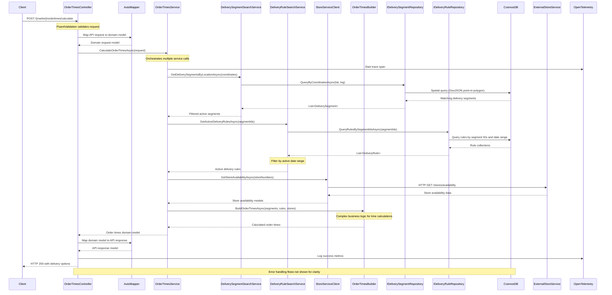

This sequence diagram shows the actual request flow based on your codebase architecture and follows your coding standards:

## **Key Architectural Elements Demonstrated:**

### **🏗️ Clean Architecture Compliance:**
- **API Layer**: `OrderTimesController` handles HTTP concerns only
- **Application Services**: `OrderTimesService` orchestrates business logic
- **Data Access**: Repositories abstract database operations
- **External Services**: `StoreServiceClient` abstracts external dependencies

### **🔄 Dependency Injection Pattern:**
- All services are injected through interfaces (`IOrderTimesService`, `IDeliverySegmentRepository`, etc.)
- Enables loose coupling and testability as per your SOLID principles

### **🗺️ Layer Boundary Enforcement:**
- **AutoMapper** ensures API models don't leak into business logic
- **FluentValidation** handles input validation at the API boundary
- Clean separation between domain models and API contracts

### **📊 Observability Integration:**
- **OpenTelemetry** provides structured logging and tracing
- Custom metrics for business operations (order time calculations)

### **🎯 Single Responsibility:**
- Each service has a focused purpose (search, rules, calculation, external data)
- `OrderTimesBuilder` handles complex calculation logic separately
- Repositories focus solely on data persistence concerns

### **⚡ Async/Await Pattern:**
- All operations use `async`/`await` as specified in your standards
- Proper handling of asynchronous database and external service calls

This diagram accurately represents how your clean architecture enables maintainable, testable, and scalable code following the SOLID principles and coding standards you've established.

FengXiaoD: 我想生成这样的mermaid code，怎么确定这些participant？使用什么样的prompt才能生成这样的mermaid code

GitHub Copilot: 要生成这样的 Mermaid sequence 

FengXiaoD: ```mermaid
sequenceDiagram
    participant Client
    participant API
    participant Service
    participant Search
    participant Repository
    participant Cosmos
    
    Client->>API: POST /ordertimes/calculate
    API->>Service: Calculate order times
    Service->>Search: Get segments by location
    Service->>Repository: Query by coordinates
    Repository->>Cosmos: Spatial query (GeoJSON)
    Cosmos-->>Repository: Matching segments
    Repository-->>Service: Delivery segments
    Service->>Search: Get delivery rules
    Search->>Repository: Query rules by segment
    Repository-->>Search: Rule sets
    Search-->>Service: Filtered active rules
    Service-->>API: Order time calculations
    API-->>Client: Response with delivery options
```

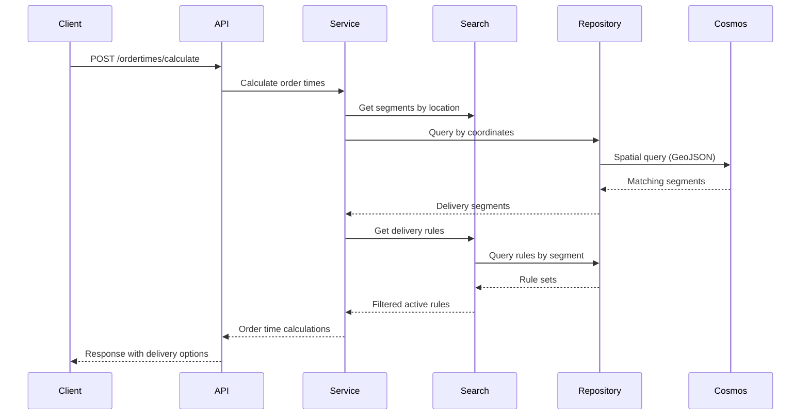

GitHub Copilot: 要生成这样的 Mermaid sequence diagram，关键是正确识别和确定 **participants（参与者）**。以下是确定参与者和生成这种图表的方法：

## **如何确定 Participants：**

### **🏗️ 基于架构层次确定参与者**

根据您的 clean architecture 和项目结构：

1. **Client** - 外部调用方（前端应用、其他服务）
2. **API** - WebApi 层的 Controller（如 `OrderTimesController`）
3. **Service** - 应用服务层（如 `OrderTimesService`）
4. **Search** - 搜索服务（如 `DeliverySegmentSearchService`）
5. **Repository** - 数据访问层（如 `IDeliverySegmentRepository`）
6. **Cosmos** - 数据库（Cosmos DB）

### **📋 用于生成此类图表的 Prompt：**

```
// Generate a Mermaid sequence diagram for a specific API workflow
/**
 * Goal: Create a sequenceDiagram showing the request flow through the clean architecture layers
 * 
 * Requirements:
 * 1. Identify participants based on the actual architecture layers:
 *    - Client (external caller)
 *    - API (Controller layer from WebApi project)
 *    - Service (Business logic from App project) 
 *    - Search (Search services from App project)
 *    - Repository (Data access interfaces from App project)
 *    - Database (Cosmos DB, Redis, etc.)
 *    - External services (Store Service, etc.)
 * 
 * 2. Trace the actual method execution flow:
 *    - Start with HTTP request
 *    - Follow controller → service → repository → database
 *    - Include return paths with responses
 * 
 * 3. Use simplified, generic participant names for clarity:
 *    - Don't use specific class names like "OrderTimesController"
 *    - Use architectural layer names: API, Service, Repository, etc.
 * 
 * 4. Focus on one specific operation workflow:
 *    - POST /ordertimes/calculate
 *    - Or GET delivery segments by location
 *    - Or delivery rule management flow
 * 
 * 5. Show the key interactions:
 *    - Request validation
 *    - Business logic orchestration  
 *    - Data queries (especially spatial queries for GeoJSON)
 *    - External service calls
 *    - Response mapping
 * 
 * Use sequenceDiagram syntax with:
 * - participant definitions
 * - Synchronous calls: A->>B  
 * - Return responses: B-->>A
 * - Descriptive message labels
 */

Generate a sequence diagram for: [specific operation like "POST /ordertimes/calculate"]
```

### **🎯 更简洁的 Prompt 版本：**

```
Create a Mermaid sequence diagram showing the flow for POST /ordertimes/calculate:

1. Use these participants (in order of architecture layers):
   - Client
   - API (controller layer)
   - Service (business logic)
   - Search (search services)  
   - Repository (data access)
   - Cosmos (database)

2. Show the key interactions:
   - Spatial queries for delivery segments
   - Business rule filtering
   - Time calculations
   - Response mapping

3. Use generic layer names, not specific class names
4. Focus on the main happy path flow
5. Include both request (->>) and response (-->>) arrows
```

### **⚡ 快速生成版本：**

```
Generate a sequence diagram for delivery time calculation workflow:
- Participants: Client, API, Service, Search, Repository, Cosmos
- Show spatial queries, rule filtering, and time calculations
- Use generic architectural layer names
- Focus on POST /ordertimes/calculate endpoint
```

## **🔍 关键要点：**

### **Participants 确定原则：**
- **按架构层次排列**：从外到内（Client → API → Service → Data）
- **使用通用名称**：`API` 而不是 `OrderTimesController`
- **代表逻辑组件**：`Search` 代表所有搜索相关服务
- **包含外部依赖**：`Cosmos`、外部服务等

### **消息流设计：**
- **请求向下流动**：`Client ->> API ->> Service ->> Repository ->> Cosmos`
- **响应向上返回**：`Cosmos -->> Repository -->> Service -->> API -->> Client`
- **描述性标签**：`"Calculate order times"` 而不是 `"CalculateAsync()"`

这样的 prompt 会生成清晰、通用、易理解的序列图，符合您的 clean architecture 原则和代码结构。

FengXiaoD: key={JSON.stringify(customerCheckoutDetails)}
        initCustomerDetails={customerCheckoutDetails}这是什么意思

GitHub Copilot: 这看起来是 **React/JavaScript** 代码中的组件属性（props）传递语法。让我为您解释这两个属性的含义：

## **代码解释：**

```javascript
key={JSON.stringify(customerCheckoutDetails)}
initCustomerDetails={customerCheckoutDetails}
```

### **🔑 `key` 属性：**
- **作用**：React 的特殊属性，用于组件的唯一标识和优化渲染
- **值**：`JSON.stringify(customerCheckoutDetails)` - 将对象转换为字符串作为 key
- **目的**：当 `customerCheckoutDetails` 对象发生变化时，React 会重新渲染组件
- **用途**：强制组件重新挂载，通常用于重置组件状态

### **📋 `initCustomerDetails` 属性：**
- **作用**：自定义属性，传递给子组件
- **值**：`customerCheckoutDetails` - 原始对象数据
- **目的**：将客户结账详情数据传递给子组件进行初始化

## **典型使用场景：**

```javascript
// 父组件
const ParentComponent = () => {
  const [customerCheckoutDetails, setCustomerCheckoutDetails] = useState({
    name: 'John Doe',
    email: 'john@example.com',
    address: '123 Main St'
  });

  return (
    <CustomerForm 
      key={JSON.stringify(customerCheckoutDetails)}
      initCustomerDetails={customerCheckoutDetails}
    />
  );
};

// 子组件
const CustomerForm = ({ initCustomerDetails }) => {
  const [formData, setFormData] = useState(initCustomerDetails);
  
  // 当 key 变化时，这个组件会完全重新挂载
  // formData 会重新初始化为新的 initCustomerDetails
};
```

## **为什么这样设计：**

1. **强制重新初始化**：当 `customerCheckoutDetails` 变化时，`key` 的变化会导致组件重新挂载
2. **避免状态污染**：确保表单组件不会保留之前的状态
3. **数据同步**：保证子组件始终使用最新的客户数据进行初始化

这是一种常见的 React 模式，特别适用于需要根据外部数据重置组件状态的场景，比如客户结账流程中切换不同客户信息时。