# dbt Project DAG (Directed Acyclic Graph)

  

## Visual DAG Structure

```mermaid

graph TB

    %% Sources

    subgraph Sources["📁 RAW DATA SOURCES"]

        SRC_SWADCS[(swadcs)]

        SRC_EDIS[(edis)]

        SRC_IEMR[(iemr)]

        SRC_CRDS[(crds)]

        SRC_DBX[(databricks system)]

    end

  

    %% Seeds

    subgraph Seeds["📊 SEEDS (Reference Data)"]

        SEED_SEX[r_patient_sex_map]

        SEED_INDIG[r_patient_indigenous_status_map]

        SEED_ARRIVAL[r_ed_arrival_mode_map]

        SEED_VISIT[r_ed_visit_type_map]

        SEED_DEPART[r_ed_departure_status_map]

        SEED_PAYMENT[r_ed_payment_class]

        SEED_FAC[r_facility_map]

    end

  

    %% ODS Layer

    subgraph ODS["🗄️ ODS LAYER (Operational Data Store)"]

        ODS_PATIENT[ods_swadcsprod__patientcurrent]

        ODS_ENCOUNTER[ods_swadcsprod__encounteritemtransaction]

        ODS_ITEM[ods_swadcsprod__itemtransaction]

        ODS_STORAGE[ods_swadcsprod__storageitemtransaction]

        ODS_DISCREPANCY[ods_swadcsprod__discrepancy]

    end

  

    %% EDW CRDS Reference Layer

    subgraph EDW_CRDS_REF["📚 EDW CRDS REFERENCE"]

        CRDS_GEN_REF[edw_crds__r_general_reference]

        CRDS_SEX[edw_crds_current__r_general_reference__sex]

        CRDS_INDIG[edw_crds_current__r_general_reference__indigenous_status]

        CRDS_COB[edw_crds_current__r_general_reference__country_of_birth]

        CRDS_EPI_END[edw_crds_current__r_general_reference__episode_end_status]

        CRDS_ICD[edw_crds__r_icd]

        CRDS_ICD_10AM[edw_crds__r_icd_10am_groups]

        CRDS_FAC_NAME[edw_crds_current__r_facility_name]

        CRDS_FAC_DET[edw_crds__r_facility_details]

        CRDS_FAC_ATTR[edw_crds__r_facility_attributes]

        CRDS_DRG[edw_crds__r_diagnosis_related_group]

        CRDS_ASGS[edw_crds__r_asgs]

        CRDS_LANG[edw_crds__r_language_coding_index]

    end

  

    %% EDW CBI Layer

    subgraph EDW_CBI["🔗 EDW CBI (Crosswalk)"]

        CBI_SNOMED_ICD[edw_cbi__r_snomed_icd]

        CBI_SNOMED_MAP[edw_cbi__r_snomed_icd_map]

    end

  

    %% Infomart Reference Layer

    subgraph IM_REF["📋 INFOMART REFERENCE"]

        IM_ARRIVAL[ed_ref__ed_transport_arrival_mode]

        IM_VISIT[ed_ref__ed_visit_type]

        IM_PAYMENT[ed_ref__ed_payment_class]

    end

  

    %% EDW IEMR Staging Layer

    subgraph EDW_IEMR_STG["🔄 EDW IEMR STAGING"]

        STG_IEMR_ENC[__stg_edw_iemr__encounter]

        STG_IEMR_ENC_INFO[__stg_edw_iemr__encounter_info]

        STG_IEMR_ENC_TRK_EVT[__stg_edw_iemr__encounter_tracking_event]

        STG_IEMR_ENC_TRK_PRSNL[__stg_edw_iemr__encounter_tracking_prsnl]

        STG_IEMR_ENC_ED_TRK[__stg_edw_iemr__encounter_ed_tracking]

        STG_IEMR_TRK_LOC[__stg_edw_iemr__tracking_locations]

        STG_IEMR_DIAG[__stg_edw_iemr__diagnosis]

        STG_IEMR_CLINICAL[__stg_edw_iemr__clinical_event]

        STG_IEMR_ORDERS[__stg_edw_iemr__orders]

        STG_IEMR_ORG_ALIAS[__stg_edw_iemr__organization_alias]

        STG_IEMR_BLDG_ALIAS[__stg_edw_iemr__building_alias]

    end

  

    %% EDW IEMR Bridge Layer

    subgraph EDW_IEMR_BRIDGE["🌉 EDW IEMR BRIDGES"]

        B_IEMR_ENC_DIAG[edw_iemr__b_encounter_diagnosis]

        B_IEMR_ENC_OBS[edw_iemr__b_encounter_observations]

        B_IEMR_ENC_ORD[edw_iemr__b_encounter_orders]

        B_IEMR_ENC_TRK_LOC[edw_iemr__b_encounter_tracking_locations]

    end

  

    %% EDW IEMR Dim Snowflake Layer

    subgraph EDW_IEMR_DSF["❄️ EDW IEMR DIM SNOWFLAKE"]

        DSF_IEMR_ENC[edw_iemr_sf__dsf_encounter]

        DSF_IEMR_ENC_INFO[edw_iemr_sf__dsf_encounter_info]

        DSF_IEMR_ENC_ACC[edw_iemr_sf__dsf_encounter_accident]

        DSF_IEMR_ENC_CLIN[edw_iemr_sf__dsf_encounter_clinical_event]

        DSF_IEMR_ENC_TRK_EVT[edw_iemr_sf__dsf_encounter_tracking_event]

        DSF_IEMR_ENC_TRK_PRSNL[edw_iemr_sf__dsf_encounter_tracking_prsnl]

        DSF_IEMR_ENC_DATETIME[edw_iemr_sf__dsf_encounter_derived_datetimes]

        DSF_IEMR_PATIENT[edw_iemr_sf__dsf_patient]

        DSF_IEMR_PATIENT_INFO[edw_iemr_sf__dsf_patient_person_info]

        DSF_IEMR_PATIENT_ALIAS[edw_iemr_sf__dsf_patient_person_alias]

        DSF_IEMR_PATIENT_ADDR[edw_iemr_sf__dsf_patient_address]

        DSF_IEMR_PATIENTORG[edw_iemr_sf__dsf_patientorg]

    end

  

    %% EDW IEMR Dimension Layer

    subgraph EDW_IEMR_DIM["📐 EDW IEMR DIMENSIONS"]

        D_IEMR_ENC[edw_iemr__d_encounter]

        D_IEMR_PATIENT[edw_iemr__d_patient]

        D_IEMR_PATIENTORG[edw_iemr__d_patientorg]

        D_IEMR_FAC[edw_iemr__d_facility]

        D_IEMR_DIAG[edw_iemr__d_diagnosis]

        D_IEMR_TRK_LOC[edw_iemr__d_tracking_locations]

    end

  

    %% EDW IEMR Fact Layer

    subgraph EDW_IEMR_FACT["📊 EDW IEMR FACTS"]

        F_IEMR_ENC[edw_iemr__f_encounter]

        F_IEMR_ENC_ED[edw_iemr__f_encounter_ed]

    end

  

    %% EDW EDIS Dimension Layer

    subgraph EDW_EDIS_DIM["📐 EDW EDIS DIMENSIONS"]

        D_EDIS_PATIENT[edw_edis__d_patient]

        D_EDIS_PRES[edw_edis__d_presentation]

        D_EDIS_PRES_PAT[edw_edis__d_presentation_patient]

        D_EDIS_FAC[edw_edis__d_facility]

        D_EDIS_OBS[edw_edis__d_observation]

    end

  

    %% EDW Common Dimensions

    subgraph EDW_COMMON["🗓️ EDW COMMON DIMENSIONS"]

        D_DATE[d_date]

        D_TIME[d_time]

        D_AGE[d_age]

    end

  

    %% Infomart OBT Layer

    subgraph IM_OBT["📈 INFOMART OBT (One Big Tables)"]

        IM_IEMR_OBT[im_iemr__obt_emergency]

        IM_EDIS_OBT[im_edis__obt_emergency]

        IM_ED_MASTER[im_ed__ed_combined_master]

    end

  

    %% Infomart Interface

    subgraph IM_INTERFACE["🔌 INFOMART INTERFACE"]

        IM_ED_CBI[im_ed_cbi__ed_combined]

    end

  

    %% System Tables

    subgraph SYSTEM["⚙️ SYSTEM TABLES"]

        SYS_ACCESS[system_access__*]

        SYS_BILLING[system_billing__*]

        SYS_COMPUTE[system_compute__*]

        SYS_QUERY[system_query__*]

        SYS_LAKEFLOW[system_lakeflow__*]

        SYS_DBX_ADV[system_dbx_warehouse_advisor__*]

    end

  

    %% ============================================

    %% DEPENDENCIES - Sources to ODS

    %% ============================================

    SRC_SWADCS --> ODS_PATIENT

    SRC_SWADCS --> ODS_ENCOUNTER

    SRC_SWADCS --> ODS_ITEM

    SRC_SWADCS --> ODS_STORAGE

    SRC_SWADCS --> ODS_DISCREPANCY

  

    %% ============================================

    %% DEPENDENCIES - Sources to EDW CRDS

    %% ============================================

    SRC_CRDS --> CRDS_GEN_REF

    SRC_CRDS --> CRDS_ICD

    SRC_CRDS --> CRDS_ICD_10AM

    SRC_CRDS --> CRDS_FAC_DET

    SRC_CRDS --> CRDS_FAC_ATTR

    SRC_CRDS --> CRDS_DRG

    SRC_CRDS --> CRDS_ASGS

    SRC_CRDS --> CRDS_LANG

  

    CRDS_GEN_REF --> CRDS_SEX

    CRDS_GEN_REF --> CRDS_INDIG

    CRDS_GEN_REF --> CRDS_COB

    CRDS_GEN_REF --> CRDS_EPI_END

  

    CRDS_FAC_ATTR --> CRDS_FAC_NAME

    CRDS_FAC_DET --> CRDS_FAC_NAME

  

    %% ============================================

    %% DEPENDENCIES - Sources to EDW IEMR Staging

    %% ============================================

    SRC_IEMR --> STG_IEMR_ENC

    SRC_IEMR --> STG_IEMR_ENC_INFO

    SRC_IEMR --> STG_IEMR_ENC_TRK_EVT

    SRC_IEMR --> STG_IEMR_ENC_TRK_PRSNL

    SRC_IEMR --> STG_IEMR_ENC_ED_TRK

    SRC_IEMR --> STG_IEMR_TRK_LOC

    SRC_IEMR --> STG_IEMR_DIAG

    SRC_IEMR --> STG_IEMR_CLINICAL

    SRC_IEMR --> STG_IEMR_ORDERS

    SRC_IEMR --> STG_IEMR_ORG_ALIAS

    SRC_IEMR --> STG_IEMR_BLDG_ALIAS

  

    %% ============================================

    %% DEPENDENCIES - Staging to Bridge

    %% ============================================

    STG_IEMR_DIAG --> B_IEMR_ENC_DIAG

    STG_IEMR_CLINICAL --> B_IEMR_ENC_OBS

    STG_IEMR_ORDERS --> B_IEMR_ENC_ORD

    STG_IEMR_TRK_LOC --> B_IEMR_ENC_TRK_LOC

  

    %% ============================================

    %% DEPENDENCIES - Staging to Dim Snowflake

    %% ============================================

    STG_IEMR_ENC --> DSF_IEMR_ENC

    STG_IEMR_ENC_INFO --> DSF_IEMR_ENC_INFO

    STG_IEMR_CLINICAL --> DSF_IEMR_ENC_CLIN

    STG_IEMR_ENC_TRK_EVT --> DSF_IEMR_ENC_TRK_EVT

    STG_IEMR_ENC_TRK_PRSNL --> DSF_IEMR_ENC_TRK_PRSNL

  

    B_IEMR_ENC_OBS --> DSF_IEMR_ENC_DATETIME

    B_IEMR_ENC_ORD --> DSF_IEMR_ENC_DATETIME

    B_IEMR_ENC_TRK_LOC --> DSF_IEMR_ENC_DATETIME

    STG_IEMR_ENC --> DSF_IEMR_ENC_DATETIME

  

    %% ============================================

    %% DEPENDENCIES - Seeds to Infomart Ref

    %% ============================================

    SEED_ARRIVAL --> IM_ARRIVAL

    SEED_VISIT --> IM_VISIT

    SEED_PAYMENT --> IM_PAYMENT

  

    %% ============================================

    %% DEPENDENCIES - Dim Snowflake to Dimensions

    %% ============================================

    DSF_IEMR_ENC --> D_IEMR_ENC

    DSF_IEMR_ENC_INFO --> D_IEMR_ENC

    DSF_IEMR_ENC_CLIN --> D_IEMR_ENC

    DSF_IEMR_ENC_ACC --> D_IEMR_ENC

  

    DSF_IEMR_PATIENT --> D_IEMR_PATIENT

    DSF_IEMR_PATIENT_INFO --> D_IEMR_PATIENT

    DSF_IEMR_PATIENT_ALIAS --> D_IEMR_PATIENT

    DSF_IEMR_PATIENT_ADDR --> D_IEMR_PATIENT

  

    DSF_IEMR_PATIENTORG --> D_IEMR_PATIENTORG

  

    STG_IEMR_TRK_LOC --> D_IEMR_TRK_LOC

  

    CBI_SNOMED_ICD --> D_IEMR_DIAG

  

    %% ============================================

    %% DEPENDENCIES - CRDS to Dimensions

    %% ============================================

    CRDS_SEX --> D_IEMR_PATIENT

    CRDS_INDIG --> D_IEMR_PATIENT

    CRDS_COB --> D_IEMR_PATIENT

  

    CRDS_EPI_END --> D_IEMR_ENC

    IM_ARRIVAL --> D_IEMR_ENC

    IM_VISIT --> D_IEMR_ENC

    IM_PAYMENT --> D_IEMR_ENC

    SEED_DEPART --> D_IEMR_ENC

  

    SEED_INDIG --> D_EDIS_PATIENT

    CRDS_SEX --> D_EDIS_PATIENT

    CRDS_INDIG --> D_EDIS_PATIENT

    CRDS_COB --> D_EDIS_PATIENT

  

    CRDS_EPI_END --> D_EDIS_PRES

  

    %% ============================================

    %% DEPENDENCIES - Staging to Facts

    %% ============================================

    STG_IEMR_ENC --> F_IEMR_ENC

    F_IEMR_ENC --> F_IEMR_ENC_ED

    DSF_IEMR_ENC_DATETIME --> F_IEMR_ENC_ED

  

    %% ============================================

    %% DEPENDENCIES - Sources to EDIS Dimensions

    %% ============================================

    SRC_EDIS --> D_EDIS_PATIENT

    SRC_EDIS --> D_EDIS_PRES

    SRC_EDIS --> D_EDIS_OBS

  

    %% ============================================

    %% DEPENDENCIES - Facts/Dims to Infomart OBT

    %% ============================================

    F_IEMR_ENC_ED --> IM_IEMR_OBT

    D_IEMR_ENC --> IM_IEMR_OBT

    D_IEMR_FAC --> IM_IEMR_OBT

    D_IEMR_PATIENT --> IM_IEMR_OBT

    D_IEMR_PATIENTORG --> IM_IEMR_OBT

    D_IEMR_DIAG --> IM_IEMR_OBT

    B_IEMR_ENC_DIAG --> IM_IEMR_OBT

  

    D_EDIS_FAC --> IM_EDIS_OBT

    CRDS_SEX --> IM_EDIS_OBT

    CRDS_COB --> IM_EDIS_OBT

    CRDS_INDIG --> IM_EDIS_OBT

  

    %% ============================================

    %% DEPENDENCIES - OBTs to Master

    %% ============================================

    IM_IEMR_OBT --> IM_ED_MASTER

    IM_EDIS_OBT --> IM_ED_MASTER

  

    %% ============================================

    %% DEPENDENCIES - Master to Interface

    %% ============================================

    IM_ED_MASTER --> IM_ED_CBI

  

    %% ============================================

    %% DEPENDENCIES - System Tables

    %% ============================================

    SRC_DBX --> SYS_ACCESS

    SRC_DBX --> SYS_BILLING

    SRC_DBX --> SYS_COMPUTE

    SRC_DBX --> SYS_QUERY

    SRC_DBX --> SYS_LAKEFLOW

  

    SYS_ACCESS --> SYS_DBX_ADV

    SYS_BILLING --> SYS_DBX_ADV

    SYS_COMPUTE --> SYS_DBX_ADV

    SYS_QUERY --> SYS_DBX_ADV

  

    %% Styling

    classDef sourceStyle fill:#e1f5ff,stroke:#01579b,stroke-width:3px

    classDef seedStyle fill:#fff9c4,stroke:#f57f17,stroke-width:2px

    classDef odsStyle fill:#f3e5f5,stroke:#4a148c,stroke-width:2px

    classDef stgStyle fill:#e8f5e9,stroke:#1b5e20,stroke-width:2px

    classDef dimStyle fill:#fff3e0,stroke:#e65100,stroke-width:2px

    classDef factStyle fill:#fce4ec,stroke:#880e4f,stroke-width:3px

    classDef obtStyle fill:#e0f2f1,stroke:#004d40,stroke-width:3px

    classDef refStyle fill:#f1f8e9,stroke:#33691e,stroke-width:2px

    classDef sysStyle fill:#eceff1,stroke:#263238,stroke-width:2px

  

    class SRC_SWADCS,SRC_EDIS,SRC_IEMR,SRC_CRDS,SRC_DBX sourceStyle

    class SEED_SEX,SEED_INDIG,SEED_ARRIVAL,SEED_VISIT,SEED_DEPART,SEED_PAYMENT,SEED_FAC seedStyle

    class ODS_PATIENT,ODS_ENCOUNTER,ODS_ITEM,ODS_STORAGE,ODS_DISCREPANCY odsStyle

    class STG_IEMR_ENC,STG_IEMR_ENC_INFO,STG_IEMR_ENC_TRK_EVT,STG_IEMR_ENC_TRK_PRSNL,STG_IEMR_ENC_ED_TRK,STG_IEMR_TRK_LOC,STG_IEMR_DIAG,STG_IEMR_CLINICAL,STG_IEMR_ORDERS,STG_IEMR_ORG_ALIAS,STG_IEMR_BLDG_ALIAS stgStyle

    class D_IEMR_ENC,D_IEMR_PATIENT,D_IEMR_PATIENTORG,D_IEMR_FAC,D_IEMR_DIAG,D_IEMR_TRK_LOC,D_EDIS_PATIENT,D_EDIS_PRES,D_EDIS_PRES_PAT,D_EDIS_FAC,D_EDIS_OBS,D_DATE,D_TIME,D_AGE dimStyle

    class F_IEMR_ENC,F_IEMR_ENC_ED factStyle

    class IM_IEMR_OBT,IM_EDIS_OBT,IM_ED_MASTER,IM_ED_CBI obtStyle

    class CRDS_GEN_REF,CRDS_SEX,CRDS_INDIG,CRDS_COB,CRDS_EPI_END,CRDS_ICD,CRDS_ICD_10AM,CRDS_FAC_NAME,CRDS_FAC_DET,CRDS_FAC_ATTR,CRDS_DRG,CRDS_ASGS,CRDS_LANG,CBI_SNOMED_ICD,CBI_SNOMED_MAP,IM_ARRIVAL,IM_VISIT,IM_PAYMENT refStyle

    class SYS_ACCESS,SYS_BILLING,SYS_COMPUTE,SYS_QUERY,SYS_LAKEFLOW,SYS_DBX_ADV sysStyle

```

  



  

## Layer Descriptions

  

### 🔵 **SOURCES** (Raw Data)

- **swadcs**: SWADCS pharmacy dispensing system

- **edis**: Emergency Department Information System

- **iemr**: Integrated Electronic Medical Record (Cerner)

- **crds**: Clinical Reference Data Service (standards/codes)

- **databricks system**: Databricks platform metadata

  

### 🟡 **SEEDS** (Static Reference Data)

CSV files containing mapping tables for standardization across systems

  

### 🟣 **ODS** (Operational Data Store)

Minimal transformation - current/active records from source systems

  

### 🟢 **STAGING** (STG)

- Clean and standardize data

- Apply business rules

- Timezone conversions

- Type casting

  

### 🔶 **DIMENSIONS** (DIM & DIM_SF)

- **DSF (Dim Snowflake)**: Intermediate denormalized dimensions

- **DIM**: Final conformed dimensions

- Patient, Encounter, Facility, Diagnosis dimensions

  

### 🔷 **BRIDGES** (BRIDGE)

Many-to-many relationship tables (e.g., encounter-to-diagnoses)

  

### 🔴 **FACTS** (FACT)

Transactional/event data with foreign keys to dimensions

  

### 🟢 **INFOMART OBT** (One Big Table)

- Fully denormalized analytics-ready tables

- Join facts with all relevant dimensions

- Business-friendly column names

  

### 🔌 **INTERFACE**

Final reporting layer exposed to external systems/users

  

### ⚙️ **SYSTEM**

Databricks platform monitoring and metadata tables

  

## Key Data Flows

  

### Emergency Department Analytics Flow

```

iemr sources → staging → dim_sf → dimensions → facts → OBT → combined_master → interface

     ↓                                         ↑

  CRDS references ─────────────────────────────┘

     ↓

  Seeds (mappings) ───────────────────────────┘

```

  

### Critical Dependencies

1. **CRDS references** must run first (used by all dimensions)

2. **Seeds** loaded before models that reference them

3. **Staging** → **Bridge/DSF** → **Dimensions** → **Facts** → **OBT**

4. **IEMR + EDIS OBTs** → **Combined Master** → **Interface**

  

## Testing Strategy

  

### High Priority Tests

1. **Sources**: Freshness tests

2. **Staging**: Not null, unique keys

3. **Dimensions**: Referential integrity

4. **Facts**: Relationship tests to dimensions

5. **OBT**: Data quality, completeness

  

### Test Locations

- [models/_properties/](models/_properties/) - Schema YAML with tests

- [tests/](tests/) - Custom SQL tests