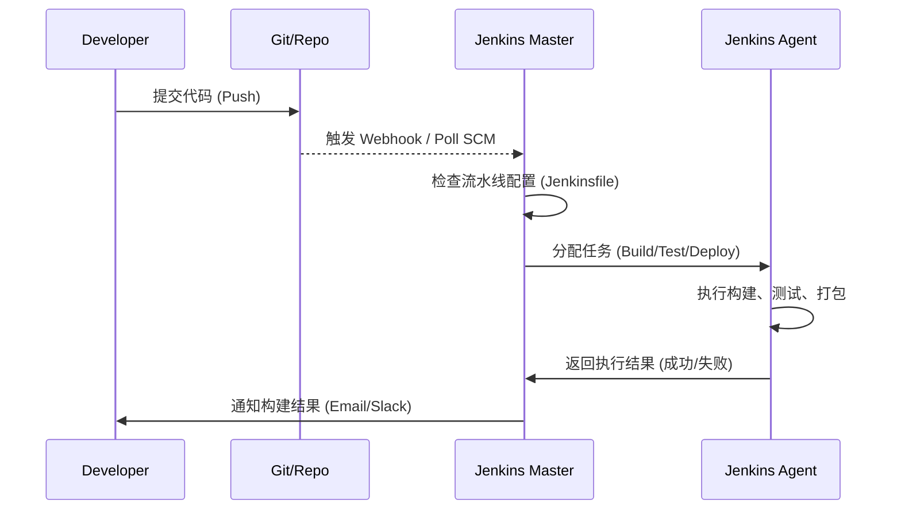

---

## 🔑 Jenkins vs Azure Pipelines 对比

|特性|**Jenkins**|**Azure Pipelines**|
|---|---|---|
|**性质**|开源（由社区维护，免费）|微软 Azure DevOps 的一部分（SaaS 服务，云原生）|
|**部署方式**|需要自己安装和维护（本地 / 云服务器 / Docker / K8s）|云端托管（Azure DevOps 服务）或自托管 Agent|
|**插件生态**|2000+ 插件，支持各种语言、平台和工具|插件有限，但深度集成 Azure 生态（Azure Functions、AKS、App Service 等）|
|**语言/平台支持**|通用（Java、Node.js、Python、.NET、Go、C++ 等）|通用（也支持各种语言），但对 **.NET / C# / Azure 云** 支持更好|
|**配置方式**|- 传统 Freestyle Jobs（图形化） - Pipeline as Code（Jenkinsfile, Groovy DSL）|- YAML Pipelines（配置即代码） - Classic UI Pipelines（可视化）|
|**扩展能力**|高度灵活，几乎所有工具都能集成|与 Azure DevOps 集成最深（Repos、Boards、Artifacts），非 Azure 工具也能接，但体验略逊|
|**成本**|软件本身免费，但需要自己维护服务器、插件、备份、扩容（人力成本高）|按用户数 / Agent 使用量付费（含免费额度），维护简单|
|**可扩展性**|Master-Agent 架构，支持大规模分布式构建|云端可弹性伸缩，支持自托管 Agent|
|**适用场景**|- 企业已有多云/混合环境 - 团队需要完全定制化 - 希望低成本但能灵活扩展|- 微软 Azure 云用户 - .NET/微软技术栈项目 - 希望少维护、快速上手的团队|

---

## 🚀 总结

- **Jenkins**：
    
    - 优点：开源、灵活、插件丰富，几乎能适配所有场景。
    - 缺点：需要自己维护（升级、扩容、插件兼容、稳定性）。
    - 更适合 **多云 / 混合 IT 环境**、对 DevOps 有强定制需求的大型组织。
- **Azure Pipelines**：
    
    - 优点：托管服务，省去了运维成本，和 Azure DevOps 生态集成紧密。
    - 缺点：依赖 Azure 生态，对非 Azure 用户吸引力没那么大。
    - 更适合 **Azure 云用户 / .NET 技术栈团队**，以及希望 **开箱即用** 的组织。

---

👉 可以这么理解：

- 如果你要的是 **最大灵活性 + 可跨任何平台** → 用 **Jenkins**
- 如果你要的是 **省心省力 + Azure 一条龙服务** → 用 **Azure Pipelines**
    

---

要不要我帮你画一张 **对比流程图**（代码提交 → 构建 → 测试 → 部署）来直观展示两者在架构上的差别？

## 一、学习 Jenkins 的核心问题

学习 Jenkins 其实就是理解 **它是干什么的、怎么运行、怎么扩展、怎么集成**。核心问题可以概括为 **“四个维度”**：

### 1️⃣ Jenkins 的本质

- Jenkins 是什么？它解决了什么问题？
- Jenkins Master 和 Agent 的作用是什么？
- Jenkins Pipeline 是什么，为什么用 Pipeline 代替 Freestyle Job？

### 2️⃣ Jenkins 流水线（Pipeline）

- Pipeline 的两种写法：Declarative vs Scripted，有什么区别？
- Jenkinsfile 的基本结构：stages、steps、agent、environment、post。
- 如何管理多分支、多环境的流水线？

### 3️⃣ Jenkins Agent（构建节点）

- 什么是 Agent，为什么需要 Agent？
- Agent 的部署方式：永久 Agent、Docker Agent、Kubernetes 动态 Agent。
- Agent 维护要点：工具安装、版本兼容、监控、资源分配。
    

### 4️⃣ 集成与自动化

- 如何集成 SCM（Git/GitHub/GitLab）触发构建？
- 如何集成构建工具（Maven、Gradle、npm）、测试工具（JUnit、Selenium、Playwright）？
- 如何集成容器与云服务（Docker、Kubernetes、Azure、AWS）？
- 如何设置通知和报告（Email、Slack、Teams）？

---

## 二、面试 Jenkins 的核心问题

面试中考察的就是你是否理解 **Jenkins 的原理、核心概念和实际操作能力**。最核心问题可以概括为 **“三大类”**：

### 1️⃣ 原理与概念类

- Jenkins 是什么？它解决了什么问题？
- Master 和 Agent 的区别与作用？
- Pipeline 是什么，Declarative 与 Scripted 有什么区别？
- Jenkins 构建触发机制有哪些？（Webhook、Poll SCM、定时构建）
- Jenkins 插件作用和维护注意事项？

### 2️⃣ 实操与问题排查类

- 如何写一个简单的 Jenkinsfile？
- 如何在 Jenkins 中集成 Git、Maven、Docker？
- 构建失败了，你如何排查原因？
- Agent 不在线或任务执行失败，你会怎么处理？
- 如何实现多环境（Dev/Test/Prod）自动部署？

### 3️⃣ 高级与架构类

- Master-Agent 分布式架构原理是什么？
- 动态 Agent（Docker / Kubernetes）是如何工作的？
- 如何保证流水线的可维护性和可扩展性？
- CI/CD 在 DevOps 流程中的价值和注意事项？

---

## 🔹 核心总结

### 学习 Jenkins 核心：

- **理解 Master-Agent 架构**
- **掌握 Pipeline/Jenkinsfile 写法**
- **学会集成构建、测试和部署工具**
- **能维护 Agent 和插件环境**

### 面试核心：

- **Master vs Agent**（原理 + 维护）
- **Pipeline/Jenkinsfile**（Declarative vs Scripted）
- **构建触发 + 集成**（Git、Docker、云服务）
- **问题排查能力**（任务失败、Agent 离线、构建报错）

---

💡 总结一句话：

> Jenkins 核心就是 **理解流水线如何工作、Master-Agent 架构如何协作、如何集成和自动化构建/测试/部署，并能排查和维护**。

---

我可以帮你画一张 **Jenkins 学习 & 面试核心知识图谱**，把 Master/Agent、Pipeline、触发机制、集成工具、排查问题都可视化，让你一眼抓住重点。
