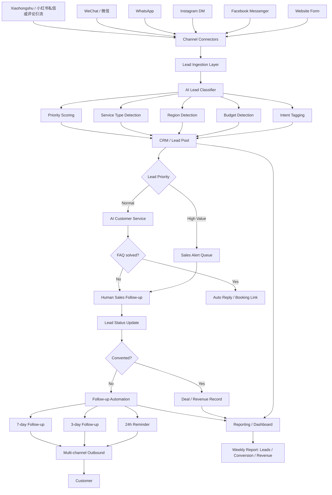
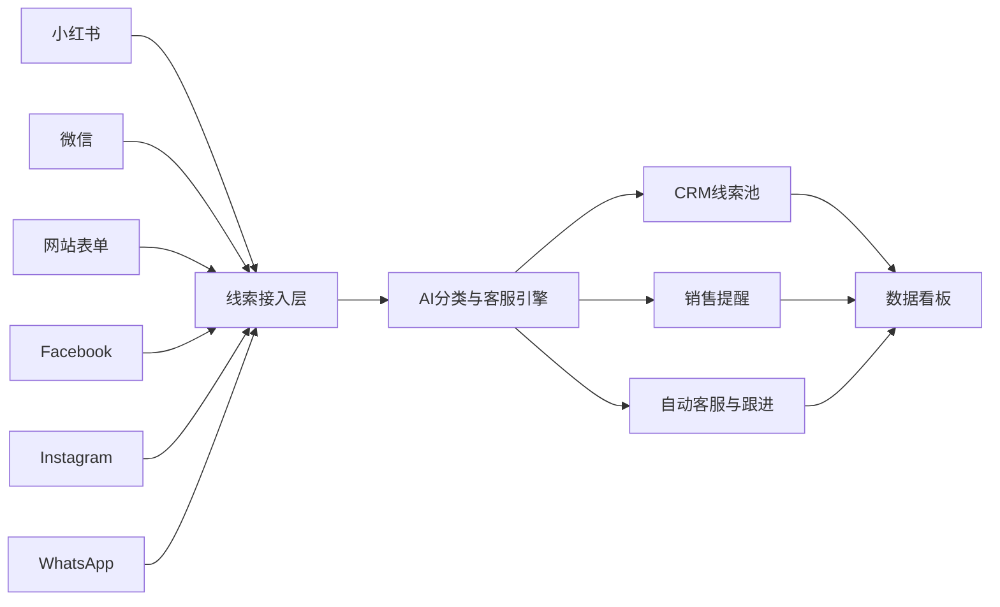
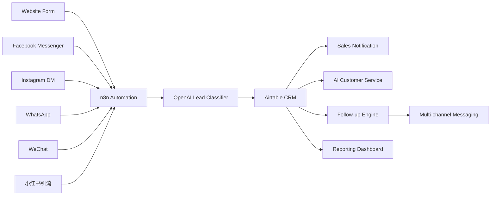
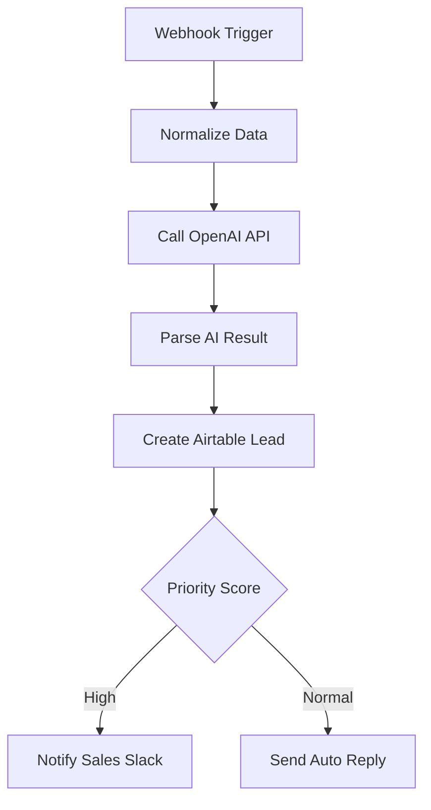
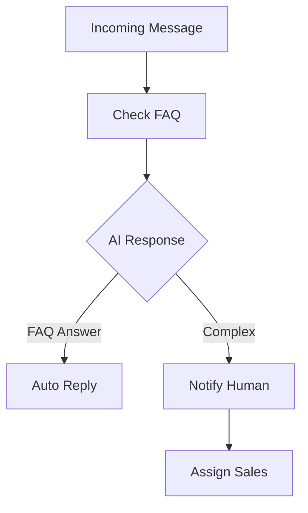
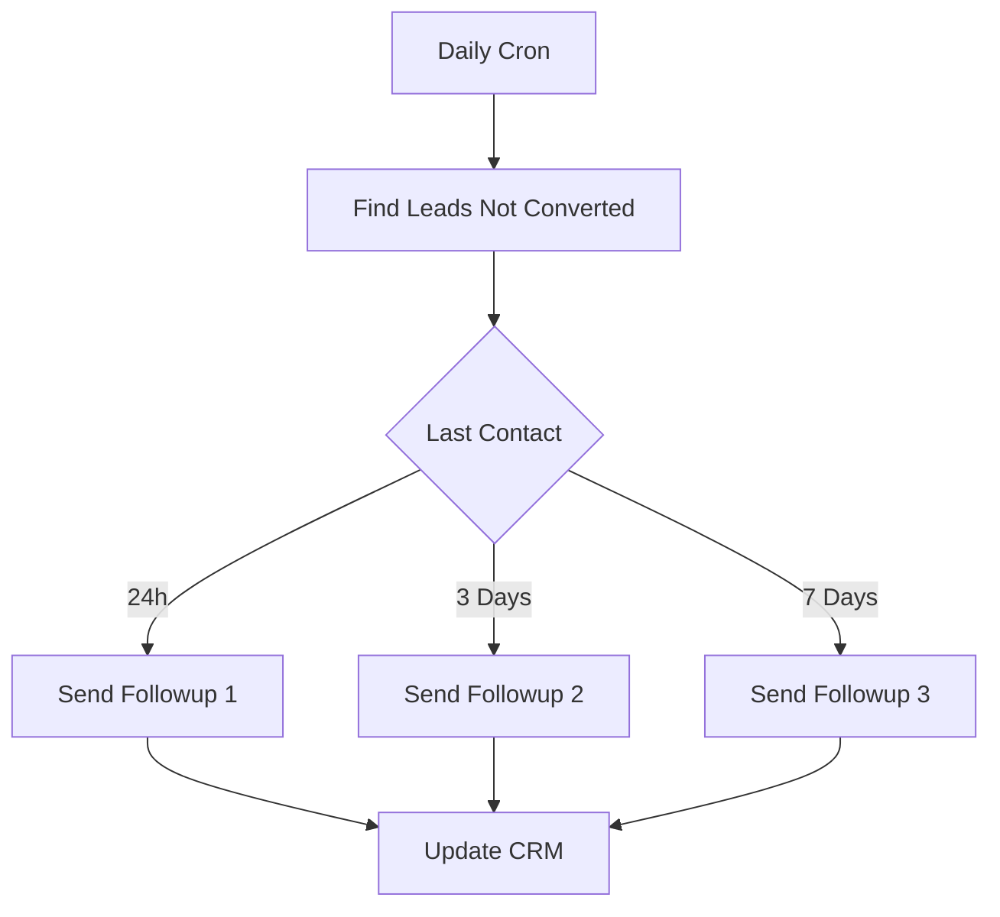
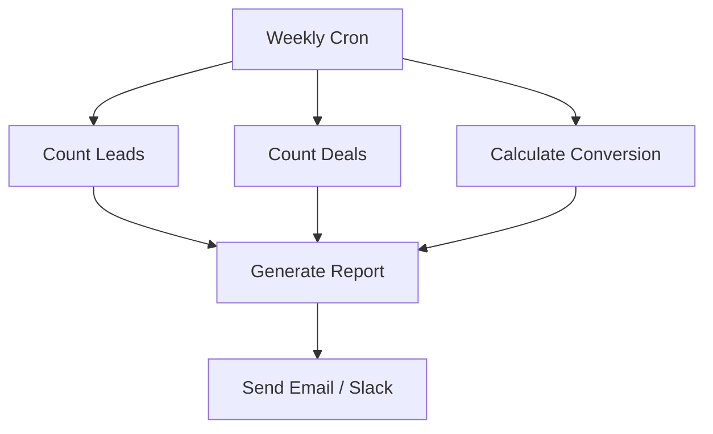

## 一、升级版整体架构图



---

## 二、渠道增加后的实际含义

现在你的渠道池变成：

- 官网表单
    
- Facebook Messenger
    
- Instagram DM
    
- WhatsApp
    
- 微信
    
- 小红书
    

这里要注意两点：

### 1. 小红书通常不是“标准客服接口”

很多时候小红书更适合做：

- 评论区引流
    
- 私信关键词触发
    
- 引导到微信 / 表单 / WhatsApp
    

也就是说，小红书更像：

```text
内容获客入口
→ 私信触发
→ 跳转到统一线索池
```

### 2. 微信适合做高价值成交和长期跟进

因为很多华人客户最终会沉淀到微信里，所以微信更适合：

- 高意向客户承接
    
- 报价沟通
    
- 成交后维护
    

---

## 三、推荐的落地分层

建议把系统拆成 6 层：

### 第 1 层：渠道接入层

负责接住所有消息和线索。

包括：

- 网站表单 webhook
    
- Meta API（Facebook / Instagram）
    
- WhatsApp Business API
    
- 微信接入
    
- 小红书接入或半自动导入
    

---

### 第 2 层：自动化编排层

负责把不同渠道统一转成一个标准线索对象。

例如统一成：

```json
{
  "source": "xiaohongshu",
  "name": "Alice",
  "message": "想了解布里斯班装修报价",
  "phone": "",
  "wechat": "alice888",
  "location": "Brisbane",
  "timestamp": "2026-03-08T12:00:00"
}
```

---

### 第 3 层：AI分析层

负责自动理解客户意图。

输出例如：

```json
{
  "intent": "quotation",
  "service_type": "renovation",
  "budget_level": "medium",
  "region": "Brisbane",
  "priority_score": 82,
  "recommended_action": "human_sales_followup"
}
```

---

### 第 4 层：CRM线索池

负责统一存储和管理状态。

字段建议包括：

- Lead ID
    
- 来源渠道
    
- 姓名
    
- 联系方式
    
- 地区
    
- 预算
    
- 服务类型
    
- 意向分数
    
- 当前阶段
    
- 最近跟进时间
    
- 下次跟进时间
    
- 成交金额
    

---

### 第 5 层：客服与跟进层

负责：

- FAQ 自动回复
    
- 预约链接推送
    
- 未成交自动跟进
    
- 多渠道提醒
    

---

### 第 6 层：报表层

负责：

- 每日线索数
    
- 渠道转化率
    
- 销售响应时间
    
- 成交金额
    
- 跟进漏斗
    

---

## 四、具体实现方式

下面我按“最实用”的方案来讲，不讲太虚的。

---

### 方案 A：低成本快速落地版

适合先试点。

#### 技术栈

- **前端表单**：Tally / Typeform / 自己网站表单
    
- **自动化编排**：Make.com / n8n
    
- **AI分类**：OpenAI API
    
- **CRM**：Airtable / Notion / HubSpot Free
    
- **通知**：Slack / Email / WeCom / 微信提醒
    
- **报表**：Google Sheets / Airtable Dashboard
    

#### 流程

1. 网站 / 小红书 / 微信 / WhatsApp / Meta 线索进入
    
2. Make / n8n 收到 webhook
    
3. 调 OpenAI API 做标签分类
    
4. 写入 Airtable CRM
    
5. 根据评分决定：
    
    - 高意向 → 发 Slack 给销售
        
    - 普通 → AI 自动回复
        
6. 未成交客户进入 24h / 3d / 7d 跟进
    
7. 每周自动生成报表
    

这个方案优点是：

- 上手快
    
- 成本低
    
- 两周能看到效果
    

---

### 方案 B：中等成熟版

适合你想做成长期可复用系统。

#### 技术栈

- **前端 / Landing Page**：Next.js
    
- **Backend API**：FastAPI / Node.js NestJS
    
- **Workflow Engine**：n8n / Temporal / BullMQ
    
- **AI Layer**：OpenAI API
    
- **CRM DB**：PostgreSQL
    
- **Admin Dashboard**：Retool / Next.js Admin / Supabase Studio
    
- **Queue**：Redis + BullMQ
    
- **Analytics**：Metabase / Superset
    
- **Authentication**：Clerk / Auth0 / Supabase Auth
    

#### 流程

```text
Channels
→ API Gateway
→ Lead Normalizer
→ AI Classifier
→ Lead DB
→ CRM Dashboard
→ Follow-up Engine
→ Notification Layer
```

这个方案更适合你以后做成：

- 内部系统
    
- 对外服务
    
- SaaS 原型
    

---

## 五、各渠道怎么接

### 1. Website

最简单。

实现：

- 网站表单提交到 webhook
    
- 写入 CRM
    
- AI 分类
    

技术：

- Next.js / WordPress 表单
    
- webhook
    
- n8n / Make / FastAPI
    

---

### 2. Facebook + Instagram

通过 Meta 平台接入。

实现：

- Facebook Messenger webhook
    
- Instagram Messaging API
    
- 消息统一进自动化层
    

技术：

- Meta Graph API
    
- webhook server
    
- n8n / 自建 Node.js
    

---

### 3. WhatsApp

用 WhatsApp Business API。

实现：

- 客户发消息
    
- webhook 接入
    
- FAQ 自动回复
    
- 转人工
    

技术：

- WhatsApp Cloud API
    
- Twilio WhatsApp
    
- Node.js / FastAPI
    

---

### 4. 微信

微信是最复杂的。

可选路径：

#### 路线 1：企业微信 / WeCom

最稳。

- 用企业微信客服或应用消息
    
- webhook / API 接入
    

#### 路线 2：公众号 / 小程序

适合正式商业化。

- 微信开放平台
    
- 消息回调
    
- 模板消息
    

#### 路线 3：半自动

先人工把高意向客户录入 CRM。

如果你是试点，我建议：

```text
先半自动，再升级企业微信
```

---

### 5. 小红书

小红书官方开放能力有限，通常建议：

#### 路线 1：引流到外部

最稳。

- 内容里引导评论关键词
    
- 私信自动回复“加微信/填表单/点链接”
    
- 再进入统一线索池
    

#### 路线 2：半自动抓取

通过运营 SOP：

- 每天导出私信 / 评论
    
- 自动导入 CRM
    

#### 路线 3：RPA

可做，但维护成本高。

- Playwright / browser automation
    
- 自动读取私信
    
- 风险高，不适合一开始就做核心链路
    

所以我建议：

```text
小红书 = 获客入口
微信 / 表单 / WhatsApp = 承接入口
```

---

## 六、AI分类提示词应该怎么做

你的 AI lead classifier 可以这样设计：

输入：

```text
Customer message:
"Hi, I need a quote for bathroom renovation in Brisbane. Budget around 20k."
```

输出结构：

```json
{
  "intent": "quote_request",
  "service_type": "bathroom_renovation",
  "budget": "20000",
  "budget_band": "medium",
  "location": "Brisbane",
  "priority_score": 85,
  "recommended_route": "sales"
}
```

分类维度建议：

- intent
    
- service_type
    
- location
    
- budget
    
- urgency
    
- lead_score
    
- next_action
    

---

## 七、推荐的最小 MVP

如果你想先试点，不要一上来做太大。

### 第一阶段只做这 4 个功能

1. **统一线索池**
    
2. **AI 自动标签**
    
3. **FAQ 自动回复**
    
4. **7 天自动跟进**
    

### 推荐技术栈

- 表单 / Landing Page：Tally 或 Next.js
    
- 自动化：n8n
    
- AI：OpenAI API
    
- CRM：Airtable
    
- 通知：Slack
    
- 报表：Google Sheets / Airtable Interface
    

这已经足够让你 2 周看到效果。

---

## 八、给你一个更适合发内容的可视化架构图



---

## 九、你如果要做成服务产品，建议包装成这三层

### 基础版

- 自动客服
    
- 线索标签
    
- 简单跟进
    

### 进阶版

- 多渠道统一
    
- AI评分
    
- 销售提醒
    
- 周报
    

### 高级版

- 自动预约
    
- 自动报价辅助
    
- 转化漏斗分析
    
- 渠道 ROI
    

---

## 十、最适合你的落地路径

结合你本身偏技术，我建议你这样做：

### 第一步

先做 **n8n + Airtable + OpenAI API** MVP

### 第二步

验证本地服务行业场景

### 第三步

把它升级成 **Next.js + FastAPI + PostgreSQL** 的正式版本

这样既能快速验证，也能逐步产品化。

---

好，我们把它继续往 **可真正落地的系统蓝图**推进。下面给你一套 **MVP 可运行架构：n8n + Airtable + OpenAI + 多渠道接入**，包括：

1. 系统总体架构
    
2. Airtable CRM 表结构
    
3. n8n 工作流设计
    
4. AI 分类 Prompt
    
5. 自动客服逻辑
    
6. 7 天自动跟进模板
    
7. 各渠道接入方式
    
8. 未来升级架构
    

---

# 一、系统总体架构（MVP）



核心思想：

所有渠道 → n8n → AI理解 → CRM → 自动客服 / 销售 / 跟进

---

# 二、Airtable CRM 表结构

建议一个 **Leads 表**。

### Leads

|字段|类型|说明|
|---|---|---|
|lead_id|Auto ID|线索ID|
|name|Text|姓名|
|phone|Text|电话|
|wechat|Text|微信|
|source|Select|来源渠道|
|message|Long Text|客户原始消息|
|service_type|Select|服务类型|
|budget|Number|预算|
|budget_level|Select|高/中/低|
|location|Text|地区|
|intent|Select|咨询/报价/预约|
|priority_score|Number|AI评分|
|status|Select|新线索/跟进中/成交|
|assigned_sales|Text|销售|
|last_contact_time|Date|最近联系|
|next_followup|Date|下次跟进|
|created_time|Date|创建时间|

---

# 三、n8n 工作流

主要需要 **4 个 workflow**。

---

# Workflow 1

线索接收



---

# Workflow 2

AI客服自动回复

逻辑：



---

# Workflow 3

自动跟进

每天运行。



---

# Workflow 4

销售周报



---

# 四、AI Lead Classifier Prompt

这是系统最关键的一部分。

### Prompt

```text
You are an AI lead classification assistant.

Extract structured information from the customer message.

Return JSON only.

Fields:
intent
service_type
budget
budget_level
location
priority_score
recommended_action

Rules:
priority_score 0-100

High priority if:
- asking for quote
- asking for appointment
- mentioning budget
```

---

### 输入

```
Customer message:
"I want a kitchen renovation quote in Brisbane. Budget about 30k."
```

---

### 输出

```json
{
  "intent": "quote_request",
  "service_type": "kitchen_renovation",
  "budget": 30000,
  "budget_level": "medium",
  "location": "Brisbane",
  "priority_score": 85,
  "recommended_action": "sales_followup"
}
```

---

# 五、AI客服 FAQ

可以准备 FAQ 库。

例如：

### FAQ表

|question|answer|
|---|---|
|价格多少|价格取决于项目大小|
|预约流程|可以先预约免费咨询|
|服务地区|我们服务 Brisbane|

---

AI回答逻辑：

```
客户消息
→ AI判断FAQ
→ 匹配回答
```

如果不在 FAQ：

```
转人工
```

---

# 六、7 天自动跟进模板

### Day 1

```
Hi {name},

Just checking if you had time to review the information we sent.

Happy to answer any questions.
```

---

### Day 3

```
Hi {name},

We still have availability this week if you'd like to schedule a quick consultation.
```

---

### Day 7

```
Hi {name},

Just wanted to follow up once more.

Let me know if you still need help or a quote.
```

---

# 七、各渠道接入方式

## Website

最简单。

```
form submit
→ webhook
→ n8n
```

---

## Facebook / Instagram

使用 Meta Graph API。

```
Messenger webhook
→ n8n
→ AI
→ CRM
```

---

## WhatsApp

推荐：

```
WhatsApp Cloud API
```

流程：

```
WhatsApp message
→ webhook
→ n8n
→ AI
```

---

## 微信

建议先：

```
企业微信 WeCom
```

优点：

- API稳定
    
- 官方支持
    

---

## 小红书

建议策略：

```
内容获客
→ 私信关键词
→ 自动回复表单
→ CRM
```

例如：

```
评论【报价】
自动回复
```

---

# 八、销售提醒

当 priority_score > 70

触发：

```
Slack notification
```

消息：

```
🔥 High-value lead

Name: John
Service: Renovation
Budget: 40k
Location: Brisbane

Contact immediately
```

---

# 九、未来升级架构

当你系统成熟，可以升级：

```mermaid
flowchart LR

Channels --> API Gateway

API Gateway --> Lead Service

Lead Service --> AI Service

Lead Service --> CRM Database

Lead Service --> Followup Engine

Followup Engine --> Messaging Service

Messaging Service --> Channels
```

技术栈：

Backend

- FastAPI / NestJS
    

Database

- PostgreSQL
    

Queue

- Redis + BullMQ
    

AI

- OpenAI / Claude
    

Dashboard

- Next.js / Retool
    

---

# 十、一个重要建议

你的系统如果未来做成 **产品**，建议三层：

### 第一层

AI自动客服

### 第二层

线索自动管理

### 第三层

销售自动化

---

# 十一、2周落地路线

### Day1-2

搭建

- Airtable
    
- n8n
    
- OpenAI
    

---

### Day3-5

接入

- 网站
    
- Facebook
    
- WhatsApp
    

---

### Day6-10

AI

- 自动标签
    
- FAQ回复
    

---

### Day10-14

自动跟进 + 报表

---

# 十二、这个项目其实很适合做产品

你可以做成：

```
AI Lead OS
for Local Businesses
```

目标客户：

- 装修
    
- 医美
    
- 房产
    
- 教育
    
- IT服务
    

---

如果你愿意，我可以继续给你：

1️⃣ **完整 n8n workflow blueprint**（可以直接搭）  
2️⃣ **AI客服 Prompt 设计**  
3️⃣ **小红书 + 微信 自动获客系统设计**  
4️⃣ **这个项目如何商业化（SaaS）**。