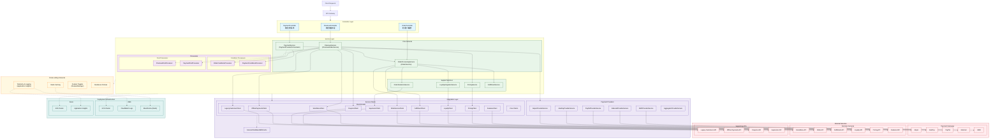

```mermaid
flowchart TB
    %% Main flow direction: Top to Bottom for better layering

    %% Client Layer
    Client[Client Requests] --> ApiGateway[API Gateway]
    ApiGateway --> ControllerLayer

    %% Controller Layer
    subgraph ControllerLayer["Controller Layer"]
        direction TB
        CheckoutController["CheckoutController\n处理结账流程"]
        PaymentController["PaymentController\n处理支付请求"]
        OrderController["OrderController\n处理订单操作"]
    end

    %% Cross-cutting Concerns - moved to the right side
    subgraph CrossCuttingLayer["Cross-cutting Concerns"]
        direction TB
        Telemetry["Telemetry & Logging\n(Application Insights)"]
        Caching["Redis Caching"]
        FeatureToggles["Feature Toggles\n(IFeatureManager)"]
        Resilience["Resilience Policies"]
    end

    %% Service Layer
    subgraph ServiceLayer["Service Layer"]
        direction TB

        subgraph CoreServices["Core Services"]
            direction TB
            CheckoutService["CheckoutService\n(CheckoutOrderService)"]
            PaymentService["PaymentService\n(PaymentProviderOrchestrator)"]
            OrderProcessingService["OrderProcessingService\n(OrdersService)"]
        end

        subgraph SupportServices["Support Services"]
            direction TB
            PricingService["PricingService"]
            OrderDonationsService["OrderDonationsService"]
            LoyaltyService["LoyaltyIntegrationService"]
            FulfillmentService["FulfillmentService"]
        end

        subgraph ProcessorsLayer["Processors"]
            direction TB
            subgraph ConditionProcessors["Condition Processors"]
                direction TB
                OrderConditionsProcessor["OrderConditionsProcessor"]
                PaymentConditionsProcessor["PaymentConditionsProcessor"]
            end

            subgraph PostProcessors["Post Processors"]
                direction TB
                CheckoutPostProcessor["CheckoutPostProcessor"]
                PaymentPostProcessor["PaymentPostProcessor"]
            end
        end
    end

    %% Controller to Service calls
    CheckoutController --> CheckoutService
    PaymentController --> PaymentService
    OrderController --> OrderProcessingService

    %% Service to Service calls
    CheckoutService --> PricingService
    CheckoutService --> OrderProcessingService
    CheckoutService --> OrderConditionsProcessor
    OrderProcessingService --> FulfillmentService
    OrderProcessingService --> OrderDonationsService
    OrderProcessingService --> LoyaltyService
    PaymentService --> PaymentConditionsProcessor

    %% Services to Post Processors
    CheckoutService -.-> CheckoutPostProcessor
    PaymentService -.-> PaymentPostProcessor

    %% Services to Cross-cutting
    ServiceLayer -.-> CrossCuttingLayer

    %% External Services - Moved below Service Layer
    subgraph ExternalServices["External Services"]
        direction TB

        subgraph PaymentGateways["Payment Gateways"]
            direction TB
            Adyen["Adyen"]
            AsiaPay["AsiaPay"]
            PayPal["PayPal"]
            Edenred["Edenred"]
            GMO["GMO"]
        end

        subgraph DominosServices["Dominos Services"]
            direction TB
            StoreMenuAPI["StoreMenu API"]
            OrderAPI["Order API"]
            FulfillmentAPI["Fulfillment API"]
            LoyaltyAPI["Loyalty API"]
            PricingAPI["Pricing API"]
            FeaturesCacheAPI["Features API"]
        end

        subgraph SupportingAPIs["Supporting APIs"]
            direction TB
            LegacyCustomersAPI["Legacy Customers API"]
            OfflinePaymentsAPI["Offline Payments API"]
            CouponsAPI["Coupons API"]
            SupervisorAPI["Supervisor API"]
        end
    end

    %% Integration Layer
    subgraph IntegrationLayer["Integration Layer"]
        direction TB

        subgraph PaymentProviders["Payment Providers"]
            direction TB
            AdyenProvider["AdyenProviderService"]
            AsiaPayProvider["AsiaPayProviderService"]
            PayPalProvider["PayPalProviderService"]
            EdenredProvider["EdenredProviderService"]
            GMOProvider["GMOProviderService"]
            AggregatorProvider["AggregatorProviderService"]
        end

        subgraph ServiceClients["Service Clients"]
            direction TB
            CoreClients["Core Clients"]
            subgraph ClientDetails["Client Details"]
                direction TB
                StoreMenuClient["StoreMenuClient"]
                OrderServiceClient["OrderServiceClient"]
                FulfillmentClient["FulfillmentClient"]
                LoyaltyClient["LoyaltyClient"]
                PricingClient["PricingClient"]
                LegacyCustomersClient["LegacyCustomersClient"]
                OfflinePaymentsClient["OfflinePaymentsClient"]
                CouponsClient["CouponsClient"]
                FeaturesClient["FeaturesClient"]
                SupervisorClient["SupervisorClient"]
            end
        end

        ServiceClientBaseWithCache["ServiceClientBaseWithCache"]
    end

    %% Service to Integration Layer calls
    PaymentService --> PaymentProviders
    ServiceLayer --> ServiceClients

    %% Specific service client calls
    OrderProcessingService --> OrderServiceClient
    CheckoutService --> StoreMenuClient
    OrderProcessingService --> FulfillmentClient
    LoyaltyService --> LoyaltyClient
    PricingService --> PricingClient
    OrderDonationsService --> SupervisorClient
    CheckoutService --> LegacyCustomersClient
    CheckoutService --> OfflinePaymentsClient
    CheckoutService --> CouponsClient

    %% Client Caching
    ServiceClients -.-> ServiceClientBaseWithCache

    %% Integration to External Services calls
    AdyenProvider --> Adyen
    AsiaPayProvider --> AsiaPay
    PayPalProvider --> PayPal
    EdenredProvider --> Edenred
    GMOProvider --> GMO

    StoreMenuClient --> StoreMenuAPI
    OrderServiceClient --> OrderAPI
    FulfillmentClient --> FulfillmentAPI
    LoyaltyClient --> LoyaltyAPI
    PricingClient --> PricingAPI
    LegacyCustomersClient --> LegacyCustomersAPI
    OfflinePaymentsClient --> OfflinePaymentsAPI
    CouponsClient --> CouponsAPI
    FeaturesClient --> FeaturesCacheAPI
    SupervisorClient --> SupervisorAPI

    %% Deployment Infrastructure
    subgraph DeploymentInfra["Deployment Infrastructure"]
        direction TB
        subgraph AWS["AWS"]
            ECS["ECS Cluster"]
            CloudWatch["CloudWatch Logs"]
            Redis["ElastiCache (Redis)"]
        end

        subgraph Azure["Azure"]
            AKS["AKS Cluster"]
            AppInsights["Application Insights"]
        end
    end

    %% App to Infrastructure relationship
    ServiceLayer -.-> ECS
    ServiceLayer -.-> AKS
    Telemetry -.-> CloudWatch
    Telemetry -.-> AppInsights
    Caching -.-> Redis

    %% Define styles for different components
    classDef controllerClass fill:#e1f5fe,stroke:#01579b,color:black;
    classDef serviceClass fill:#e8f5e9,stroke:#1b5e20,color:black;
    classDef integrationClass fill:#ede7f6,stroke:#4527a0,color:black;
    classDef externalClass fill:#ffebee,stroke:#b71c1c,color:black;
    classDef crossCuttingClass fill:#fff8e1,stroke:#ff6f00,color:black;
    classDef processorClass fill:#f3e5f5,stroke:#7b1fa2,color:black;
    classDef infrastructureClass fill:#e0f2f1,stroke:#00695c,color:black;

    %% Apply styles
    class CheckoutController,PaymentController,OrderController controllerClass;
    class CoreServices,SupportServices,CheckoutService,PaymentService,OrderProcessingService,PricingService,OrderDonationsService,LoyaltyService,FulfillmentService serviceClass;
    class ProcessorsLayer,OrderConditionsProcessor,PaymentConditionsProcessor,CheckoutPostProcessor,PaymentPostProcessor processorClass;
    class IntegrationLayer,PaymentProviders,ServiceClients,CoreClients,ClientDetails,AdyenProvider,AsiaPayProvider,PayPalProvider,EdenredProvider,GMOProvider,AggregatorProvider,StoreMenuClient,OrderServiceClient,FulfillmentClient,LoyaltyClient,PricingClient,LegacyCustomersClient,OfflinePaymentsClient,CouponsClient,FeaturesClient,SupervisorClient,ServiceClientBaseWithCache integrationClass;
    class ExternalServices,PaymentGateways,DominosServices,SupportingAPIs,Adyen,AsiaPay,PayPal,Edenred,GMO,StoreMenuAPI,OrderAPI,FulfillmentAPI,LoyaltyAPI,PricingAPI,LegacyCustomersAPI,OfflinePaymentsAPI,CouponsAPI,FeaturesCacheAPI,SupervisorAPI externalClass;
    class CrossCuttingLayer,Telemetry,Caching,FeatureToggles,Resilience crossCuttingClass;
    class DeploymentInfra,AWS,Azure,ECS,CloudWatch,Redis,AKS,AppInsights infrastructureClass;
```
