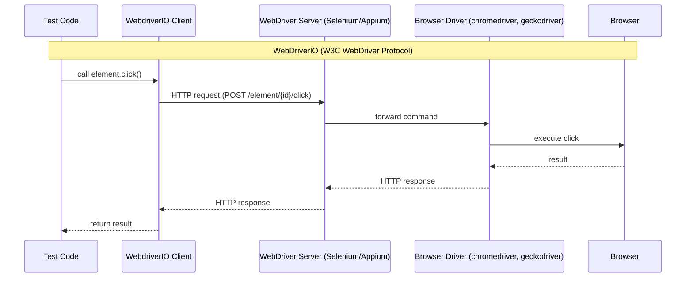
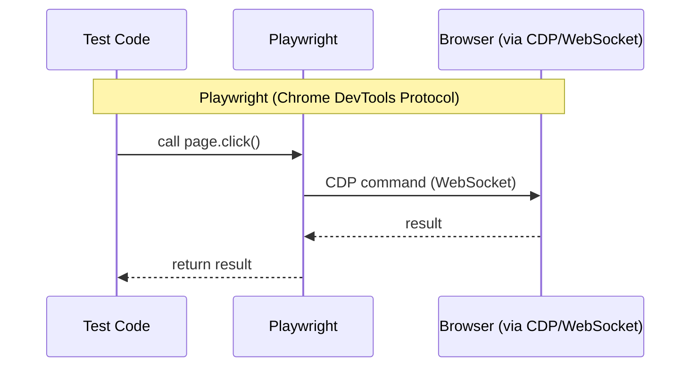

WebdriverIO workflow




## 🔹 1. WebDriver Protocol (used by WebdriverIO)

- **How it works**:
    
    - WebdriverIO sends commands (e.g., `click`, `findElement`) →
    - Appium/Selenium server receives them →
    - Server forwards them to the browser driver (e.g., `chromedriver`, `geckodriver`) →
    - Browser executes the command and responds via HTTP →
    - The response travels back the same way.
        
- **Flow (multi-hop communication)**
    
    ```
    Test Code → WebdriverIO client → Appium/Selenium server → Browser driver → Browser
    ```
    
- **Implication**:
    
    - Each command = an **HTTP request/response round trip**.
        
    - Introduces **latency** and more **failure points** (timeouts, session loss).
        
    - Good standardization → any language/client that speaks WebDriver can drive any browser.
        

---

## 🔹 2. Chrome DevTools Protocol (used by Playwright)

- **How it works**:
    
    - Playwright connects directly to the browser via **WebSocket**.
        
    - Commands (e.g., `page.click()`, `page.evaluate()`) are sent directly to the browser engine.
        
    - Browser responds immediately over the same persistent WebSocket.
        
- **Flow (direct channel)**
    
    ```
    Test Code → Playwright → Browser (via CDP/WebSocket)
    ```
    
- **Implication**:
    
    - **Faster & more reliable** (no extra HTTP server layer).
        
    - Can access **low-level browser features**: network interception, console logs, performance metrics, etc.
        
    - Less “universal” → tightly coupled to supported engines (Chromium, Firefox, WebKit).
        

---

## 🔹 3. How This Difference Shows Up in Practice

| Aspect              | **WebDriver Protocol (WDIO)**                              | **CDP (Playwright)**                                                          |
| ------------------- | ---------------------------------------------------------- | ----------------------------------------------------------------------------- |
| **Command latency** | Each action is a separate HTTP call → slower               | Persistent WebSocket → faster                                                 |
| **Flakiness**       | More prone to “stale element”, timeouts, race conditions   | Less flaky due to auto-wait & direct communication                            |
| **Features**        | Limited to standardized WebDriver APIs (click, type, etc.) | Can access advanced DevTools features (network mocking, JS coverage, tracing) |
| **Cross-platform**  | Works with any browser that implements WebDriver           | Only works with browsers Playwright ships (Chromium, Firefox, WebKit)         |
| **Debugging**       | Harder to get browser internals                            | Rich debugging (trace viewer, console, HAR, coverage)                         |

---

✅ **Analogy**:

- **WebDriver** = calling someone through a call center:
    
    - You (test) → operator (WebDriver server) → another operator (browser driver) → actual person (browser).
        
- **Playwright** = calling the person directly on their mobile phone.
    

---

Would you like me to **draw a Mermaid sequence diagram** to visually compare the command flow between WebDriver (WDIO) and Playwright (CDP)? That way the multi-hop vs direct path becomes crystal clear.

# This is the Playwright protocol





你贴的表格里，其实每一行差别都直接来自 **协议设计（WebDriver vs CDP）** 和 **客户端库实现（WDIO vs Playwright）** 的不同。下面我逐点解释 **为什么会有这种差别**：

---

### 1. Command latency

- **WebDriver Protocol (WDIO)**：
    
    - 每个动作（如 click、type、getText）都要单独发一次 **HTTP 请求** 到远程的 WebDriver server（Selenium Grid、chromedriver、geckodriver、Appium 等）。
        
    - HTTP 是 **无状态的**，每次命令执行都需要建立请求 → 解析 → 执行 → 返回 → 关闭。
        
    - 因此**延迟更高**，特别是跨网络（远程 Grid）。
        
- **CDP (Playwright)**：
    
    - 通过 **WebSocket 长连接**与浏览器直接通信。
        
    - 命令不需要每次重新握手，而是保持一条开放的管道。
        
    - → 所以命令发送和反馈速度更快，延迟更低。
        

---

### 2. Flakiness

- **WebDriver**：
    
    - 命令是同步 HTTP 调用，但浏览器状态可能还没准备好（DOM 还没渲染、元素被替换），于是容易产生 **stale element reference** 或 **timeout**。
        
    - 框架需要额外写 `waitUntil`、`sleep`、`retry` 等逻辑来缓解。
        
- **Playwright**：
    
    - 内置 **auto-waiting** 机制（自动等待元素可见、可点击、动画完成）。
        
    - 命令不会立刻报错，而是等到条件满足或超时。
        
    - → 因为和浏览器有更强的状态同步，所以测试更稳定。
        

---

### 3. Features

- **WebDriver**：
    
    - 遵循 **W3C WebDriver 标准**，所以功能基本限定在 **用户操作层面**（click, sendKeys, navigate, screenshot）。
        
    - 无法直接访问浏览器的底层功能（如拦截网络请求、获取性能指标、代码覆盖率）。
        
- **Playwright (CDP)**：
    
    - 直接调用 **Chrome DevTools Protocol**，拥有浏览器的 **内部能力**（JS runtime、网络层、性能、调试 hooks）。
        
    - 可以做 **network mocking, HAR recording, JS coverage, tracing, video recording** 等高级测试能力。
        

---

### 4. Cross-platform

- **WebDriver**：
    
    - 是 **跨浏览器标准**，任何支持 WebDriver 的浏览器（Chrome, Firefox, Safari, Edge, mobile browsers via Appium）都能跑。
        
    - → 优点是广泛兼容，缺点是功能受限于标准。
        
- **Playwright**：
    
    - Playwright 自带特定版本的 **Chromium, Firefox, WebKit**（三大内核）。
        
    - → 优点是浏览器环境可控、测试一致性强。
        
    - → 缺点是无法直接驱动“任意浏览器”（比如系统里用户安装的 Opera、IE 等）。
        

---

### 5. Debugging

- **WebDriver**：
    
    - 只能得到 API 层面的反馈，比如 “element not found”。
        
    - 很难直接看浏览器内部状态，比如 JS console、网络流量、性能指标 → 需要额外插件（如 BrowserMob Proxy、DevTools Bridge）。
        
- **Playwright**：
    
    - 内置丰富的调试工具：
        
        - **Trace Viewer**：自动记录 DOM 变化、快照、网络请求、console 日志。
            
        - **HAR recording**：完整的网络日志。
            
        - **Coverage**：查看 CSS/JS 代码使用率。
            
    - 因为直接连 CDP，所以能实时访问浏览器内部。
        

---

✅ 总结：  
差别的根本原因就是：

- **WebDriver** → 走 HTTP + W3C 标准 → 兼容性强，但功能受限，延迟高。
    
- **Playwright** → 走 WebSocket + CDP → 功能强，速度快，内置等待和调试，但兼容性范围有限。
    

---

要不要我帮你把这些解释再整理成一份 **对比表（带解释原因）**，像“差别 + 为什么”这样一目了然？